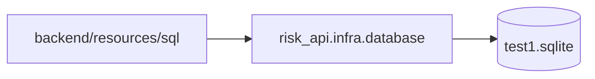

# C4 代码级文档：backend/resources/sql

## 1. 概述

- **名称**：SQL 查询定义
- **描述**：HugSQL SQL 文件，定义所有针对导入的 `test1.sqlite` schema 的读写查询。运行时不会执行 DDL 或迁移；这些文件仅包含 `:name` HugSQL 指令。
- **位置**：`backend/resources/sql/`
- **语言**：SQL（SQLite 方言）
- **用途**：为 `risk_api.infra.database` 与领域层提供数据库契约。

## 2. 文件

- `legacy.sql` – 旧版表查询（`supervise_risk`、`supervise_enterprise`、`supervise_index`、`sys_dept`、`supervise_index_risk_relationship` 等）。
- `workflow.sql` – 闭环工作流表查询（`supervise_risk_description`、`supervise_risk_confirmation`、`supervise_risk_disposal_plan_step`、`supervise_risk_disposal_plan_step_detail`、`supervise_risk_level_change`、`supervise_risk_operation_log`、`supervise_message_record`）。

## 3. 代码元素

### `legacy.sql` 关键查询

| 查询 | 指令 | 用途 |
|-------|-----------|---------|
| `count-risks` | `:? :1` | 多列筛选统计风险数。 |
| `list-risks` | `:? :*` | 关联字典与部门列出风险行。 |
| `count-enterprises` / `list-enterprises` | `:? :1` / `:? :*` | 企业 CRUD/读取查询。 |
| `list-departments` | `:? :*` | 返回筛选中使用的 8 个固定部门。 |
| `count-indicators` / `list-indicators` | `:? :1` / `:? :*` | 指标读取查询。 |
| `find-risk-by-id` | `:? :1` | 按 ID 加载单个风险。 |
| `update-risk-status!` | `:! :n` | 更新风险状态。 |
| `find-enterprise-by-id` / `create-enterprise!` / `update-enterprise!` / `delete-enterprise!` | （多种） | 企业 CRUD。 |
| `list-enterprise-options` / `list-equity-enterprises` | `:? :*` | 企业选择器与树数据。 |
| `find-indicator-by-id` / `create-indicator!` / `update-indicator!` / `delete-indicator!` | （多种） | 指标 CRUD。 |
| `find-indicator-risk-setting` / `list-indicator-risk-settings` / `delete-indicator-risk-setting!` / `save-indicator-risk-setting!` | （多种） | 指标风险等级映射。 |

### `workflow.sql` 关键查询

| 查询 | 指令 | 用途 |
|-------|-----------|---------|
| `find-risk-by-source-key` | `:? :1` | 按外部来源键做幂等查找。 |
| `create-manual-risk!` | `:! :1` | 插入风险记录。 |
| `transition-risk-status!` | `:! :n` | 带允许状态的条件更新。 |
| `create-description-draft!` / `submit-description!` / `latest-description` / `due-descriptions` / `auto-submit-description!` | （多种） | 风险情况描述工作流。 |
| `create-confirmation!` / `latest-confirmation` / `audit-confirmation!` | （多种） | 风险确认工作流。 |
| `create-legacy-plan-step!` / `current-plan-steps` / `find-plan-step` / `latest-plan-step` / `update-plan-step-state!` | （多种） | 处置计划步骤持久化。 |
| `create-legacy-progress!` / `update-legacy-progress!` / `delete-legacy-progress!` / `list-progresses` | （多种） | 处置进度持久化。 |
| `set-risk-plan-state!` / `overdue-risk-ids` | （多种） | 计划状态与逾期扫描。 |
| `create-level-change!` / `latest-level-change` / `audit-level-change!` / `update-risk-level!` | （多种） | 风险等级变更工作流。 |
| `create-operation-log!` / `list-operation-logs` | （多种） | 操作审计日志。 |
| `create-message!` | `:! :1` | 待办/TODO 消息记录创建。 |
| `list-disposal-steps-by-risk` | `:? :*` | 风险下的步骤列表。 |
| `list-pending-reviews` / `list-reviewed-reviews` | `:? :*` | 审核队列查询。 |

## 4. 依赖

- **内部依赖**：`test1.sqlite` schema（假设所有引用的表均已存在）
- **外部依赖**：`com.layerware/hugsql`（用于将这些文件编译为 Clojure 函数）

## 5. 关系

