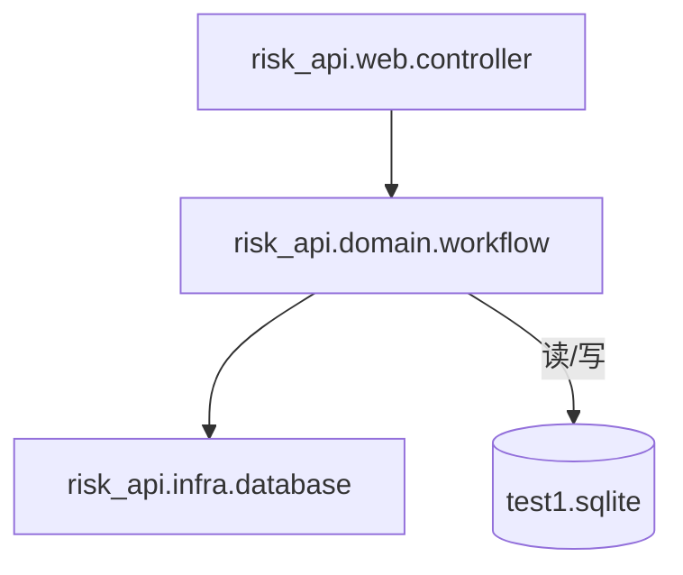

# C4 代码级文档：backend/src/risk_api/domain

## 1. 概述

- **名称**：风险工作流领域
- **描述**：实现风险生命周期状态机（情况描述、确认、审核、处置计划、进度、完成、消除、等级变更）以及所有写端业务操作。每次写操作都在 SQLite 事务内执行，并记录在 `supervise_risk_operation_log` 中。
- **位置**：`backend/src/risk_api/domain/`
- **语言**：Clojure
- **用途**：在不修改任何数据库 schema 的前提下，强制执行 1:1 克隆风险监管流程的业务规则。

## 2. 文件

- `workflow.clj` – 完整风险闭环工作流的领域函数。

## 3. 代码元素

### `risk_api.domain.workflow`

- **命名空间**：`risk-api.domain.workflow`
- **依赖**：`clojure.string`、`risk-api.infra.database`（别名为 `db`）

#### 常量 / 状态码

| 名称 | 值 | 含义 |
|------|-------|---------|
| `description-pending` | `7` | 情况描述待处理 |
| `unconfirmed` | `0` | 未确认 |
| `confirmed` | `1` | 已确认 |
| `eliminated` | `2` | 已消除 |
| `closed` | `3` | 已关闭 |
| `confirm-pending` | `4` | 确认待审核 |
| `close-pending` | `5` | 关闭待审核 |
| `elimination-pending` | `6` | 消除待审核 |

#### 私有辅助函数

| 名称 | 签名 | 描述 | 位置 |
|------|-----------|-------------|----------|
| `error` | `[message] -> map` | 返回失败信封 `{:code 500 :msg message}`。 | 第 14 行 |
| `success` | `[data] -> map` | 返回成功信封 `{:code 0 :msg "success" :data data}`。 | 第 15 行 |
| `operator` | `[body] -> string` | 从 body 中提取 `operator`，默认"管理员"。 | 第 16 行 |
| `entity-id` | `[] -> long` | 生成随机的 16 位数字 ID。 | 第 17 行 |
| `bool?` | `[value] -> boolean` | 严格检查值是否为 `true` 或 `false`。 | 第 18 行 |
| `special-enterprise?` | `[risk] -> boolean` | 对"集团直管"或"集团本部"企业为真。 | 第 19–20 行 |
| `log!` | `[ds risk-id category remark who & [{:keys [decision-content new-risk-level]}]]` | 写入 `supervise_risk_operation_log` 一行。 | 第 23–25 行 |
| `todo!` | `[ds kind risk-id recipient]` | 通过 `db/create-message!` 在 `supervise_message_record` 中创建 TODO。 | 第 26–28 行 |
| `transition!` | `[ds risk-id allowed next category remark who]` | 在允许的状态中将 `operation_status` 条件更新为下一个状态，然后记录日志。 | 第 29–33 行 |

#### 公共工作流函数

| 名称 | 签名 | 描述 | 位置 |
|------|-----------|-------------|----------|
| `create-manual-risk!` | `[datasource risk] -> result map` | 校验必填字段并插入手工映射风险。集团本部初始状态为情况描述 (7)，否则为未确认 (0)；创建描述草稿或确认 TODO。 | 第 35–56 行 |
| `initialize-description!` | `[datasource risk-id due-at] -> result map` | 将风险从未确认转为情况描述，并创建描述草稿。 | 第 58–69 行 |
| `submit-description!` | `[datasource risk-id body] -> result map` | 校验发生原因，状态 7 -> 0，更新描述行，创建确认 TODO。 | 第 71–81 行 |
| `timeout-descriptions!` | `[datasource _] -> result map` | 对所有到期的描述，转为未确认并自动提交描述。 | 第 83–92 行 |
| `submit-confirmation!` | `[datasource risk-id body] -> result map` | 校验 `isRisk`，状态 0 -> 4 或 5，写入确认记录与审核 TODO。 | 第 94–107 行 |
| `audit-confirmation!` | `[datasource risk-id body] -> result map` | 审核待确认记录；按矩阵转为已确认或已关闭。 | 第 109–127 行 |
| `risk-review!` | `[datasource body] -> result map` | 兼容旧版的 `audit-confirmation!` 别名。 | 第 129 行 |
| `create-plan!` | `[datasource risk-id body] -> result map` | 校验计划/步骤，持久化处置计划步骤，设置计划状态为 0。 | 第 131–148 行 |
| `submit-progress!` | `[datasource step-id body] -> result map` | 为步骤添加进度，更新步骤状态，设置计划状态为 1。 | 第 150–166 行 |
| `submit-plan-completion!` | `[datasource risk-id body] -> result map` | 校验所有步骤完成，标记完成待审核；特殊企业直接消除待审核。 | 第 168–183 行 |
| `audit-disposal!` | `[datasource risk-id body] -> result map` | 审核处置完成；通过时触发消除申请。 | 第 185–199 行 |
| `request-elimination!` | `[datasource risk-id body] -> result map` | 状态 已确认 -> 消除待审核，创建审核 TODO。 | 第 201–206 行 |
| `audit-elimination!` | `[datasource risk-id body] -> result map` | 审核消除申请；转为已消除或返回已确认。 | 第 208–219 行 |
| `request-level-change!` | `[datasource risk-id body] -> result map` | 创建等级变更申请记录。 | 第 221–237 行 |
| `audit-level-change!` | `[datasource risk-id body] -> result map` | 审核等级变更；通过时更新风险等级。 | 第 239–250 行 |
| `refresh-overdue-plans!` | `[datasource _] -> result map` | 将逾期风险的计划状态设为 2。 | 第 252–257 行 |
| `process-persisted-dynamics!` | `[_ _] -> result map` | 占位：外部动态摄入不在本次范围内。 | 第 259–260 行 |

## 4. 依赖

- **内部依赖**：`risk-api.infra.database`（所有持久化与事务）
- **外部依赖**：`clojure.string`、`java.time.LocalDateTime`（通过互操作）、HugSQL 生成的函数

## 5. 关系

