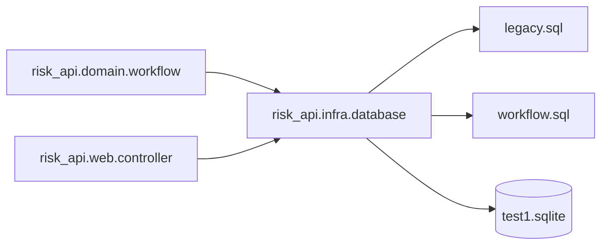

# C4 代码级文档：backend/src/risk_api/infra

## 1. 概述

- **名称**：基础设施层
- **描述**：后端的数据库组件。提供 Integrant 数据源生命周期、HugSQL 查询注册、共享查询选项及事务包装器。
- **位置**：`backend/src/risk_api/infra/`
- **语言**：Clojure、SQL
- **用途**：通过 `next.jdbc` 与 HugSQL 抽象 SQLite 访问；使领域层与 Web 层无需接触 DDL 即可执行查询与事务。

## 2. 文件

- `database.clj` – 数据源组件与事务辅助。
- SQL 查询引用自 `backend/resources/sql/legacy.sql` 与 `backend/resources/sql/workflow.sql`。

## 3. 代码元素

### `risk_api.infra.database`

- **命名空间**：`risk-api.infra.database`
- **依赖**：`hugsql.core`、`hugsql.adapter.next-jdbc`、`integrant.core`、`next.jdbc`、`next.jdbc.result-set`

#### 函数 / 多方法

| 名称 | 签名 | 描述 | 位置 |
|------|-----------|-------------|----------|
| `(hugsql/set-adapter! ...)` | （副作用） | 配置 HugSQL 使用 next-jdbc 适配器。 | 第 9–11 行 |
| `hugsql/def-db-fns` | `["sql/legacy.sql"]` / `["sql/workflow.sql"]` | 将 SQL 文件函数加载到命名空间；生成 `create-manual-risk!`、`list-risks`、`transaction!` 等变量。 | 第 13–14 行 |
| `ig/init-key :risk-api/database` | `[key {:keys [jdbc-url]}] -> map` | 构建 `next.jdbc` 数据源并存入 `:datasource`。 | 第 16–19 行 |
| `ig/halt-key! :risk-api/database` | `[key _database]` | 停止时无操作。 | 第 21–22 行 |
| `query-opts` | `[] -> map` | 返回 `{:builder-fn rs/as-unqualified-lower-maps}`，用于生成小写关键字映射。 | 第 24–26 行 |
| `transaction!` | `[datasource f]` | 在 `jdbc/with-transaction` 块中运行 `f`；`f` 接收事务绑定的 datasource。 | 第 28–31 行 |

#### 生成的 HugSQL 函数（节选）

由 `sql/legacy.sql` 与 `sql/workflow.sql` 生成，命名空间暴露众多查询函数。关键示例：

| 生成函数 | 元数 | 用途 |
|-------------------|-------|---------|
| `count-risks` | `[datasource params]` | 统计风险数量用于分页。 |
| `list-risks` | `[datasource params]` | 列出风险行，关联字典与部门。 |
| `count-enterprises` / `list-enterprises` | `[datasource params]` | 企业 CRUD/读取查询。 |
| `list-indicators` / `count-indicators` | `[datasource params]` | 指标读取查询。 |
| `create-manual-risk!` | `[datasource params]` | 插入新风险记录。 |
| `transition-risk-status!` | `[datasource params]` | 条件状态更新。 |
| `create-description-draft!` / `submit-description!` | `[datasource params]` | 情况描述持久化。 |
| `create-confirmation!` / `audit-confirmation!` | `[datasource params]` | 确认持久化。 |
| `create-legacy-plan-step!` / `current-plan-steps` / `update-plan-step-state!` | `[datasource params]` | 处置计划操作。 |
| `create-legacy-progress!` / `list-progresses` | `[datasource params]` | 处置进度操作。 |
| `create-level-change!` / `audit-level-change!` / `update-risk-level!` | `[datasource params]` | 等级变更操作。 |
| `create-operation-log!` / `list-operation-logs` | `[datasource params]` | 审计日志操作。 |
| `create-message!` | `[datasource params]` | 待办/消息记录创建。 |
| `list-pending-reviews` / `list-reviewed-reviews` | `[datasource params]` | 审核队列查询。 |

## 4. 依赖

- **内部依赖**：`backend/resources/sql/legacy.sql`、`backend/resources/sql/workflow.sql`
- **外部依赖**：`com.layerware/hugsql`、`com.layerware/hugsql-adapter-next-jdbc`、`com.github.seancorfield/next.jdbc`、`org.xerial/sqlite-jdbc`、`integrant`

## 5. 关系

