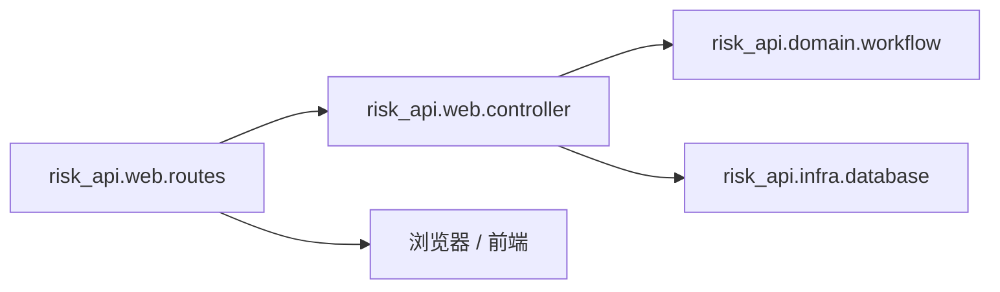

# C4 代码级文档：backend/src/risk_api/web

## 1. 概述

- **名称**：Web / HTTP 层
- **描述**：风险 API 的 Ring/Reitit HTTP 处理器与路由。将 JSON 请求体与查询参数转换为 snake_case 的数据库命令，并返回旧版 `{code,msg,data}` JSON 信封。
- **位置**：`backend/src/risk_api/web/`
- **语言**：Clojure
- **用途**：暴露兼容原前端的 REST 端点，包括登录、风险/企业/指标 CRUD 以及风险闭环工作流。

## 2. 文件

- `controller.clj` – HTTP 请求处理器与响应辅助。
- `routes.clj` – Reitit 路由器、中间件（CORS、JSON body、参数）与路由装配。

## 3. 代码元素

### `risk_api.web.controller`

- **命名空间**：`risk-api.web.controller`
- **依赖**：`clojure.string`、`jsonista.core`、`risk-api.domain.workflow`、`risk-api.infra.database`

#### 辅助函数

| 名称 | 签名 | 描述 | 位置 |
|------|-----------|-------------|----------|
| `camel-key` | `[key] -> string` | 将 snake_case 关键字转为 camelCase 字符串。 | 第 8–12 行 |
| `camelize` | `[value] -> value` | 递归将映射键转为 camelCase，并将长整型 ID 转为字符串。 | 第 14–25 行 |
| `response` | `[body]` / `[status body] -> Ring response` | 将 body 包装为 JSON `application/json; charset=utf-8` 响应。 | 第 27–31 行 |
| `parse-int` | `[value default] -> int` | 安全整数解析。 | 第 33–35 行 |
| `optional` | `[value] -> value or nil` | 将空白字符串转为 nil。 | 第 37–38 行 |
| `body-value` | `[body key] -> value` | 通过字符串或关键字 key 从 body 读取值。 | 第 40–42 行 |
| `integer-value` | `[value default] -> int` | 将数字/字符串归一化为 long。 | 第 44–48 行 |
| `company-command` | `[body] -> map` | 将企业请求体映射为 snake_case 命令。 | 第 50–55 行 |
| `indicator-command` | `[body] -> map` | 将指标请求体映射为 snake_case 命令。 | 第 57–64 行 |
| `page-params` | `[request] -> map` | 提取分页与筛选查询参数。 | 第 66–80 行 |

#### 处理器

| 名称 | 签名 | 端点 / 用途 | 位置 |
|------|-----------|-------------------|----------|
| `login` | `[request] -> response` | `POST /api/login` 返回固定本地 token。 | 第 82–83 行 |
| `risk-page` | `[datasource request] -> response` | `GET /api/supervise/risk/page` | 第 85–89 行 |
| `enterprise-page` | `[datasource request] -> response` | `GET /api/supervise/enterprise/page` | 第 91–95 行 |
| `department-list` | `[datasource _] -> response` | `GET /api/sys/dept/list` | 第 97–99 行 |
| `enterprise-get` | `[datasource request] -> response` | `GET /api/supervise/enterprise/:id`（分页/树） | 第 101–107 行 |
| `enterprise-options` | `[datasource _] -> response` | `GET /api/supervise/enterprise/:id`（post） | 第 109–111 行 |
| `equity-enterprises` | `[datasource request] -> response` | `GET /api/enterprise/alls` | 第 113–118 行 |
| `enterprise-post` | `[datasource request] -> response` | `POST /api/supervise/enterprise/:id` | 第 120–124 行 |
| `index-page` | `[datasource request] -> response` | `GET /api/supervise/index/page` | 第 126–130 行 |
| `index-get` | `[datasource request] -> response` | `GET /api/supervise/index/:id` | 第 132–141 行 |
| `index-post` | `[datasource request] -> response` | `POST /api/supervise/index/:id` | 第 143–149 行 |
| `create-enterprise` | `[datasource request] -> response` | `POST /api/supervise/enterprise` | 第 151–158 行 |
| `update-enterprise` | `[datasource request] -> response` | `PUT /api/supervise/enterprise` | 第 160–167 行 |
| `delete-enterprise` | `[datasource request] -> response` | `DELETE /api/supervise/enterprise/:id` | 第 169–176 行 |
| `create-indicator` | `[datasource request] -> response` | `POST /api/supervise/index` | 第 178–184 行 |
| `update-indicator` | `[datasource request] -> response` | `PUT /api/supervise/index` | 第 186–193 行 |
| `delete-indicator` | `[datasource request] -> response` | `DELETE /api/supervise/index/:id` | 第 195–203 行 |
| `indicator-risk` | `[datasource request] -> response` | `GET/POST /api/supervise/index/risk` | 第 205–222 行 |
| `risk-review` | `[datasource request] -> response` | `POST /api/supervise/risk/riskReview` | 第 224–226 行 |
| `risk-operation-logs` | `[datasource request] -> response` | `GET /api/supervise/risk/superviseRiskOperationLog/getLogByRiskId` | 第 228–231 行 |
| `disposal-step-page` | `[datasource request] -> response` | `GET /api/demo/superviseriskdisposalplanstep/page` | 第 233–238 行 |
| `risk-handle` | `[datasource request] -> response` | `POST /api/supervise/risk/riskHandle` | 第 240–252 行 |
| `risk-situation` | `[datasource request] -> response` | `POST /api/supervise/risk/riskSituation` | 第 254–266 行 |
| `export-risks` | `[datasource _] -> response` | `GET /api/supervise/risk/export` | 第 268–276 行 |
| `manual-risk` | `[datasource request] -> response` | `POST /api/supervise/risk/manual` | 第 278–300 行 |
| `description` | `[datasource request] -> response` | `POST /api/supervise/risk/:id/description` | 第 302–314 行 |
| `confirmation` | `[datasource request] -> response` | `POST /api/supervise/risk/:id/confirm` | 第 316–318 行 |
| `confirmation-audit` | `[datasource request] -> response` | `POST /api/supervise/risk/:id/confirmation-audit` | 第 320–322 行 |
| `disposal-plan` | `[datasource request] -> response` | `POST /api/supervise/risk/:id/disposal-plans` | 第 324–326 行 |
| `process-persisted-dynamics` | `[datasource request] -> response` | `POST /api/supervise/risk/dynamics/process` | 第 327–328 行 |
| `timeout-descriptions` | `[datasource request] -> response` | `POST /api/supervise/risk/jobs/description-timeout` | 第 329–330 行 |
| `disposal-progress-page` | `[datasource request] -> response` | `GET /api/supervise/disposal-steps/:id/progress` | 第 331–335 行 |
| `disposal-progress` | `[datasource request] -> response` | `POST /api/supervise/disposal-steps/:id/progress` | 第 336–337 行 |
| `disposal-complete` | `[datasource request] -> response` | `POST /api/supervise/risk/:id/disposal-complete` | 第 338–339 行 |
| `refresh-overdue-plans` | `[datasource request] -> response` | `POST /api/supervise/risk/jobs/disposal-overdue` | 第 340–341 行 |
| `disposal-audit` | `[datasource request] -> response` | `POST /api/supervise/risk/:id/disposal-audit` | 第 342–343 行 |
| `elimination` | `[datasource request] -> response` | `POST /api/supervise/risk/:id/elimination` | 第 344–345 行 |
| `elimination-audit` | `[datasource request] -> response` | `POST /api/supervise/risk/:id/elimination-audit` | 第 346–347 行 |
| `level-change` | `[datasource request] -> response` | `POST /api/supervise/risk/:id/level-changes` | 第 348–349 行 |
| `level-change-audit` | `[datasource request] -> response` | `POST /api/supervise/risk/:id/level-change-audit` | 第 350–351 行 |
| `pending-reviews` | `[datasource _] -> response` | `GET /api/supervise/risk/pending-reviews` | 第 352–353 行 |
| `reviewed-reviews` | `[datasource _] -> response` | `GET /api/supervise/risk/reviewed-reviews` | 第 354–355 行 |

### `risk_api.web.routes`

- **命名空间**：`risk-api.web.routes`
- **依赖**：`jsonista.core`、`reitit.ring`、`ring.middleware.params`、`risk-api.web.controller`

#### 函数

| 名称 | 签名 | 描述 | 位置 |
|------|-----------|-------------|----------|
| `wrap-json-body` | `[handler] -> handler` | 解析 `application/json` 请求体到 `:body-params`；失败时返回 400。 | 第 8–16 行 |
| `wrap-cors` | `[handler] -> handler` | 为 `http://localhost:5173` 添加 CORS 头；处理 OPTIONS。 | 第 18–25 行 |
| `app` | `[datasource] -> handler` | 装配包含所有路由、默认 404 与中间件的 Ring 处理器。 | 第 27–83 行 |

#### 路由表（节选）

- `POST /api/login`
- `GET /api/sys/dept/list`
- `GET /api/enterprise/alls`
- `GET /api/supervise/risk/page`
- `GET /api/supervise/risk/pending-reviews`、`GET /api/supervise/risk/reviewed-reviews`
- `POST /api/supervise/risk/riskHandle`、`POST /api/supervise/risk/riskSituation`
- `GET /api/supervise/risk/superviseRiskOperationLog/getLogByRiskId`
- `GET /api/demo/superviseriskdisposalplanstep/page`
- `POST/PUT /api/supervise/enterprise`、`GET/POST/DELETE /api/supervise/enterprise/:id`
- `POST/PUT /api/supervise/index`、`GET/POST/DELETE /api/supervise/index/:id`
- `GET /api/supervise/risk/export`
- `POST /api/supervise/risk/manual`
- `POST /api/supervise/risk/riskReview`
- `POST /api/supervise/risk/:id/description`
- `POST /api/supervise/risk/:id/confirm`
- `POST /api/supervise/risk/:id/confirmation-audit`
- `POST /api/supervise/risk/dynamics/process`
- `POST /api/supervise/risk/jobs/description-timeout`
- `GET/POST /api/supervise/disposal-steps/:id/progress`
- `POST /api/supervise/risk/:id/disposal-complete`
- `POST /api/supervise/risk/jobs/disposal-overdue`
- `POST /api/supervise/risk/:id/disposal-audit`
- `POST /api/supervise/risk/:id/elimination`
- `POST /api/supervise/risk/:id/elimination-audit`
- `POST /api/supervise/risk/:id/level-changes`
- `POST /api/supervise/risk/:id/level-change-audit`
- `POST /api/supervise/risk/:id/disposal-plans`

## 4. 依赖

- **内部依赖**：`risk-api.web.controller`、`risk-api.domain.workflow`、`risk-api.infra.database`
- **外部依赖**：`metosin/reitit-ring`、`ring/ring-jetty-adapter`、`ring.middleware.params`、`jsonista`

## 5. 关系

