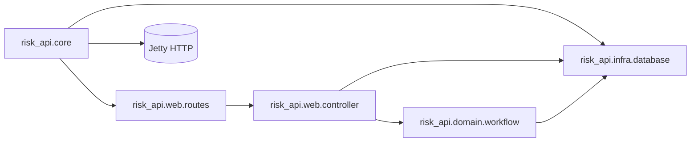

# C4 代码级文档：backend/src/risk_api

## 1. 概述

- **名称**：risk_api 命名空间根
- **描述**：根应用命名空间，负责装配 Integrant 系统、启动 Jetty HTTP 服务器，并引入 domain、infrastructure 与 web 子命名空间。
- **位置**：`backend/src/risk_api/`
- **语言**：Clojure
- **用途**：提供运行时主入口与默认系统配置（数据库 URL、HTTP 端口）。

## 2. 文件 / 目录

- `core.clj` – 入口与 Integrant 方法。
- `domain/` – 业务工作流。
- `infra/` – 数据库访问。
- `web/` – HTTP 控制器与路由。

## 3. 代码元素

### `risk_api.core`

- **命名空间**：`risk-api.core`
- **依赖**：`integrant.core`、`ring.adapter.jetty`、`risk-api.web.routes`、`risk-api.infra.database`

#### 函数 / 多方法

| 名称 | 签名 | 描述 | 位置 |
|------|-----------|-------------|----------|
| `ig/init-key :risk-api/http-server` | `[key {:keys [port database]}]` | 在 `port` 上启动 Jetty 服务器，使用 `routes/app` 生成的 Ring 处理器。 | `core.clj` 第 8–10 行 |
| `ig/halt-key! :risk-api/http-server` | `[key server]` | 停止运行中的 Jetty 服务器。 | `core.clj` 第 12–13 行 |
| `system-config` | `[] -> map` | 构建默认 Integrant 配置；解析 `RISK_API_DB` 与 `PORT` 环境变量。 | `core.clj` 第 15–19 行 |
| `-main` | `[& _]` | 初始化 Integrant 系统并打印监听 URL。 | `core.clj` 第 21–24 行 |

## 4. 依赖

- **内部依赖**：`risk_api.domain.workflow`、`risk_api.infra.database`、`risk_api.web.routes`、`risk_api.web.controller`
- **外部依赖**：`integrant`、`ring-jetty-adapter`

## 5. 关系

