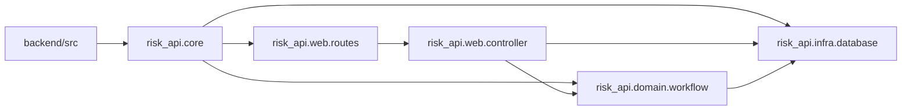

# C4 代码级文档：backend/src

## 1. 概述

- **名称**：后端源码树
- **描述**：Clojure 源码根目录，包含 `risk_api` 命名空间层级。入口点为 `risk_api.core`。
- **位置**：`backend/src/`
- **语言**：Clojure
- **用途**：将应用代码组织为核心生命周期、领域工作流、基础设施与 Web 层。

## 2. 文件 / 目录

- `risk_api/` – 应用命名空间。
  - `core.clj` – Integrant 生命周期与主入口。
  - `domain/workflow.clj` – 风险生命周期状态机。
  - `infra/database.clj` – 数据源与事务。
  - `web/controller.clj` – HTTP 处理器。
  - `web/routes.clj` – Reitit 路由表。

## 3. 代码元素

`backend/src/` 下没有直接存在的代码文件；它是 `risk_api` 命名空间的结构路径前缀。

## 4. 依赖

- **内部依赖**：`backend/src/risk_api/`（core、domain、infra、web）
- **外部依赖**：无直接外部依赖。

## 5. 关系

