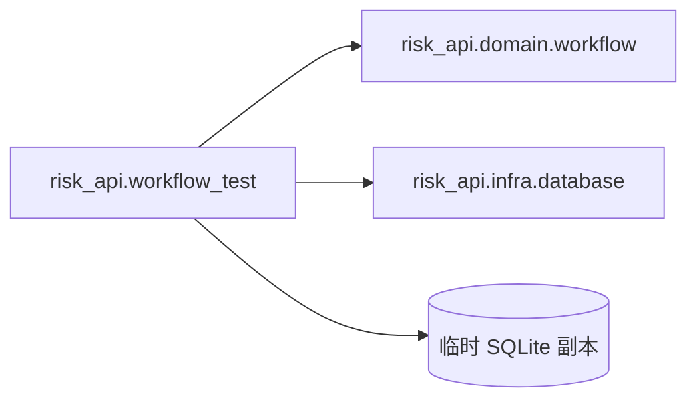

# C4 代码级文档：backend/test/risk_api

## 1. 概述

- **名称**：后端工作流测试
- **描述**：针对临时复制的 `test1.sqlite` 运行完整风险闭环状态机的 Clojure 单元测试。
- **位置**：`backend/test/risk_api/`
- **语言**：Clojure
- **用途**：验证领域工作流函数正确转换状态，并写入操作日志与消息记录。

## 2. 文件

- `workflow_test.clj` – 测试命名空间。

## 3. 代码元素

### `risk_api.workflow_test`

- **命名空间**：`risk-api.workflow-test`
- **依赖**：`clojure.java.io`、`clojure.test`、`next.jdbc`、`risk-api.domain.workflow`、`risk-api.infra.database`

#### 函数

| 名称 | 签名 | 描述 | 位置 |
|------|-----------|-------------|----------|
| `copied-datasource` | `[] -> datasource` | 创建 `../test1.sqlite` 的临时副本并返回 next-jdbc 数据源。 | 第 5–11 行 |
| `create-mapped-risk!` | `[ds id] -> nil` | 向复制后的数据库插入最简测试风险行。 | 第 13–18 行 |

#### 测试

| 名称 | 描述 | 位置 |
|------|-------------|----------|
| `complete-workflow-test` | 将风险走过 情况描述 -> 未确认 -> 确认待审核 -> 已确认 -> 处置计划 -> 进度 -> 完成审核 -> 消除审核 -> 已消除，断言状态码与审计日志。 | 第 20–42 行 |
| `description-timeout-test` | 创建一条描述待处理风险并设置过期截止日期，验证 `timeout-descriptions!` 自动提交它。 | 第 44–51 行 |

## 4. 依赖

- **内部依赖**：`risk-api.domain.workflow`、`risk-api.infra.database`、`../test1.sqlite`
- **外部依赖**：`clojure.test`、`next.jdbc`、`io.github.cognitect-labs/test-runner`（通过 deps 别名）

## 5. 关系

