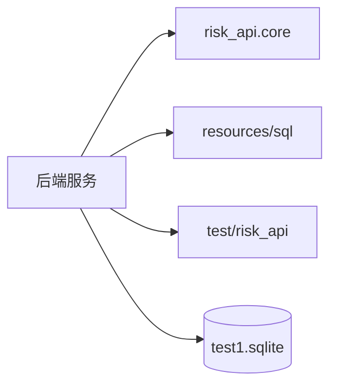

# C4 代码级文档：backend

## 1. 概述

- **名称**：后端服务
- **描述**：基于 Clojure 的 HTTP API 服务器，替代本地克隆原系统 `http://172.16.40.152:8101/` 的后端。它读取导入的 `test1.sqlite` 数据库，仅使用已有表，并暴露兼容的 REST API。
- **位置**：`backend/`
- **语言**：Clojure、SQL、Markdown
- **用途**：提供风险、企业、指标、审核与处置工作流端点；启动时不执行 DDL 或 schema 迁移。

## 2. 关键文件

- `deps.edn` – Clojure tools-deps 依赖与别名配置。
- `README.md` – 本地运行说明及环境覆盖（`PORT`、`RISK_API_DB`）。
- `src/risk_api/` – 应用源码（core、domain、infra、web）。见 `c4-code-backend-src-risk_api.md` 及子文档。
- `resources/sql/` – HugSQL SQL 查询文件（`legacy.sql`、`workflow.sql`）。见 `c4-code-backend-resources-sql.md`。
- `test/risk_api/workflow_test.clj` – 领域工作流单元测试。见 `c4-code-backend-test-risk_api.md`。

## 3. 子目录速览

| 目录 | 用途 | 备注 |
|------|------|------|
| `src/` | 应用源码树 | 详见 `c4-code-backend-src.md` |
| `src/risk_api/` | 命名空间根 | 详见 `c4-code-backend-src-risk_api.md` |
| `src/risk_api/domain/` | 业务工作流状态机 | 详见 `c4-code-backend-src-risk_api-domain.md` |
| `src/risk_api/infra/` | 数据库基础设施 | 详见 `c4-code-backend-src-risk_api-infra.md` |
| `src/risk_api/web/` | HTTP 路由与控制器 | 详见 `c4-code-backend-src-risk_api-web.md` |
| `resources/sql/` | HugSQL 查询定义 | 详见 `c4-code-backend-resources-sql.md` |
| `resources/migrations/` | 回滚 SQL 产物，仅供参考 | 运行时不执行 |
| `resources/test1.sqlite` | 导入的数据库副本 | 运行时读取 |
| `test/risk_api/` | 工作流单元测试 | 详见 `c4-code-backend-test-risk_api.md` |
| `test-reports/` | 生成的测试报告 HTML | 构建产物 |
| `docs/` | API 契约说明 | 非运行代码 |
| `.cpcache/` | 构建缓存 | 分析时排除 |

## 4. 代码元素

`backend/` 下没有顶层可执行代码；所有函数位于 `src/risk_api/` 和 `resources/sql/` 下。

## 5. 依赖

- **内部依赖**：`backend/src/risk_api/`、`backend/resources/sql/`、`backend/test/risk_api/`、`../test1.sqlite`
- **外部依赖**（在 `deps.edn` 中声明）：
  - `org.clojure/clojure 1.12.0`
  - `integrant/integrant 0.13.1`
  - `ring/ring-jetty-adapter 1.14.2`
  - `metosin/reitit-ring 0.9.1`
  - `metosin/jsonista 0.3.13`
  - `com.github.seancorfield/next.jdbc 1.3.1048`
  - `org.xerial/sqlite-jdbc 3.50.3.0`
  - `com.layerware/hugsql 0.5.3` 与 `hugsql-adapter-next-jdbc 0.5.3`
  - `io.github.cognitect-labs/test-runner`（仅测试别名）

## 6. 关系

