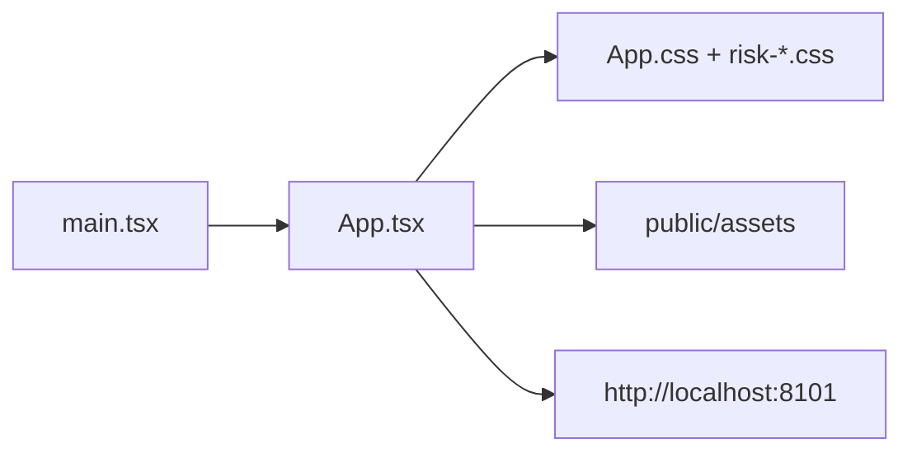

# C4 代码级文档：frontend/src

## 1. 概述

- **名称**：前端源码
- **描述**：包含所有 React 组件、样式与应用入口点。整个 UI 在单个 `App.tsx` 文件中实现，并辅以 CSS 文件。
- **位置**：`frontend/src/`
- **语言**：TypeScript、TSX、CSS
- **用途**：渲染登录页、头部、首页仪表盘、股权结构、风险监控网格、系统管理、我的审核以及所有模态对话框。

## 2. 文件

- `main.tsx` – React 应用入口（StrictMode、createRoot、渲染 `App`）。
- `App.tsx` – 主应用组件，包含所有页面、组件、状态与 API 调用。
- `index.css` – 全局重置与基础字体样式。
- `App.css` – 布局、仪表盘、头部、侧边菜单、表格、筛选、对话框与响应式规则。
- `risk-confirm.css` – 风险确认与处置计划对话框样式。
- `risk-entry.css` – 风险录入对话框样式。
- `assets/` – 额外本地资产（如有）。

## 3. 代码元素

### `main.tsx`

| 名称 | 签名 | 描述 | 位置 |
|------|-----------|-------------|----------|
| （默认渲染） | `(createRoot(...).render(<StrictMode><App /></StrictMode>))` | 将应用挂载到 `#root`。 | 第 5–9 行 |

### `App.tsx`

- **依赖**：React hooks（`useEffect`、`useRef`、`useState`、`FormEvent`）、`App.css`、`risk-confirm.css`、`risk-entry.css`。
- **默认导出**：`App` 组件。

#### 顶层常量

| 名称 | 值 / 类型 | 描述 | 位置 |
|------|--------------|-------------|----------|
| `A` | `"/assets/"` | 静态资产前缀。 | 第 5 行 |
| `nav` | `string[]` | 顶部导航标签：首页、股权结构、风险监控、风险报告、统计分析、系统管理。 | 第 6–13 行 |
| `levels` | `array` | 风险等级汇总卡片，包含数量与图标名。 | 第 14–19 行 |
| `risks` | `array` | 12 个直接风险类别卡片，包含图标名。 | 第 20–33 行 |

#### 组件（节选）

| 名称 | Props | 描述 | 位置 |
|------|-------|-------------|----------|
| `Header` | `{ active, setActive, onLogout }` | 40px 顶部导航栏、品牌、菜单、通知、用户下拉。 | 第 36–79 行 |
| `LoginPage` | `{ onLogin }` | 渐变登录界面，含用户名/密码。 | 第 80–91 行 |
| `Home` | `()` | 主搜索 + 仪表盘，含风险等级与直接类别卡片。 | 第 92–130 行 |
| `Equity` | `()` | 双栏股权结构（左侧树、右侧 QCC iframe）。 | 第 131–177 行 |
| `buildEquityTree` | `[rows] -> EquityEnterprise[]` | 根据扁平 `pids` 字段构建父子树。 | 第 166–178 行 |
| `EquityTreeNode` | `{ item, keyword, selected, onSelect }` | 递归树节点，支持展开/收起。 | 第 179–205 行 |
| `SideMenu` / `StatisticsSideMenu` | `{ name, page, setPage }` | 左侧模块导航。 | 第 206–263 行 |
| `PendingCascader` | `{ placeholder, value, items, onChange }` | 多选级联筛选组件。 | 第 264–302 行 |
| `FilterBar` | `{ label? }` | 简单筛选输入栏。 | 第 303–321 行 |
| `RiskInfoView` | `()` | 完整风险信息页，含筛选、表格、分页与操作模态框。 | 第 322–583 行 |
| `RiskEntryDialog` | `{ departmentNames, onClose, onSave }` | 创建新映射风险的对话框。 | 第 584–680 行 |
| `RiskActionDialog` | `{ modal, onClose, onChanged }` | 详情 / 全景 / 确认 / 消除 / 情况描述模态框。 | 第 681–798 行 |
| `DisposalPlanDialog` | `{ row, steps, standalone?, onClose?, onSaved? }` | 完整处置计划编辑器与进度查看器。 | 第 799–1000+ 行 |
| `RiskLogTable` / `PlanStepTable` | `{ rows }` | 操作日志与计划步骤表格。 | 文件后部 |
| `SystemDataView` | `{ kind: "company" \| "indicator" }` | 企业 / 指标管理页。 | 文件后部 |
| `PendingReview` | `()` | 待审核与已审核页面。 | 文件后部 |
| `PendingRiskPanorama` | `{ enterpriseName }` | 给定企业的风险全景视图。 | 文件后部 |
| `DynamicAdjust` | `{ onAudit }` | 动态调整页签占位。 | 文件后部 |
| `DataTable` | `{ headers, rows }` | 报表与系统占位页使用的通用表格。 | 文件后部 |
| `ModuleView` | `{ name }` | 报表、统计与系统管理的通用模块外壳。 | 文件后部 |
| `Statistics` | `{ page }` | 统计仪表盘卡片与图表。 | 文件后部 |
| `App` | `()` | 根组件，包含 hash 路由、登录状态与页面路由。 | 文件末尾 |

#### 关键辅助函数

| 名称 | 签名 | 描述 | 位置 |
|------|-----------|-------------|----------|
| `riskSessionToken` | `async () -> string` | 执行 `admin/admin` 登录并返回 API token。 | 位于 `RiskActionDialog` 附近 |

## 4. 依赖

- **内部依赖**：`frontend/src/App.css`、`frontend/src/risk-confirm.css`、`frontend/src/risk-entry.css`、`frontend/src/index.css`、`frontend/public/assets/`
- **外部依赖**：`react`、`react-dom`

## 5. 关系

