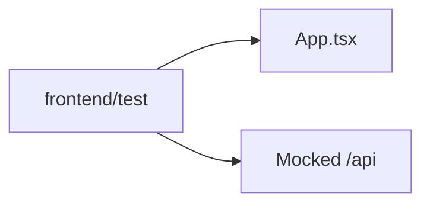

# C4 代码级文档：frontend/test

## 1. 概述

- **名称**：前端端到端测试
- **描述**：Playwright 测试，模拟登录用户在风险信息页上进行筛选、对话框、分页与处置计划交互。
- **位置**：`frontend/test/`
- **语言**：TypeScript
- **用途**：在不依赖真实后端的情况下验证 UI 行为与 API 请求格式。

## 2. 文件

- `risk-monitor.spec.ts` – Playwright 测试套件。

## 3. 代码元素

### `risk-monitor.spec.ts`

- **依赖**：`@playwright/test`

#### 类型

- `State` – `{ description: boolean; confirmation: boolean; elimination: boolean; requests: Record<string, unknown>[] }`

#### 辅助函数

| 名称 | 签名 | 描述 | 位置 |
|------|-----------|-------------|----------|
| `apiState` | `(state: State) -> (route, request) -> Promise<void>` | 路由处理器，mock `/api/**` 响应并记录 POST 请求。 | 文件顶部 |

#### 测试

| 名称 | 描述 | 位置 |
|------|-------------|----------|
| `情况描述：准备待描述风险后，通过页面填写并提交` | 打开情况描述对话框，填写字段，断言 POST 请求格式。 | 文件中部 |
| `风险确认：准备未确认风险后，通过页面确认是风险` | 打开确认对话框，断言确认 POST 请求体。 | 文件中部 |
| `风险消除：准备已确认且处置完成的风险后，通过页面提交消除` | 打开消除对话框，断言 POST 请求体。 | 文件中部 |
| `情况描述：未填写发生原因时阻止提交并显示校验提示` | 校验测试。 | 文件中部 |
| `筛选和重置：企业名称作为查询条件发送，并可清空表单` | 筛选与重置行为。 | 文件中部 |
| `分页：点击第二页后按 pageNum=2 重新查询` | 分页测试。 | 文件中部 |
| `详情与取消：弹窗展示风险内容和操作记录，取消不提交数据` | 详情弹窗与取消行为。 | 文件中部 |
| `新增风险：企业名称支持中文输入法最终值` | 风险录入对话框输入测试。 | 文件中部 |
| `风险信息检索：企业名称支持逐字中文输入并传给查询接口` | 搜索输入到 API 的测试。 | 文件中部 |
| `处置计划：保存时调用计划创建接口` | 处置计划对话框保存计划。 | 文件中部 |

## 4. 依赖

- **内部依赖**：`frontend/src/App.tsx`（通过开发服务器间接使用）
- **外部依赖**：`@playwright/test`

## 5. 关系

