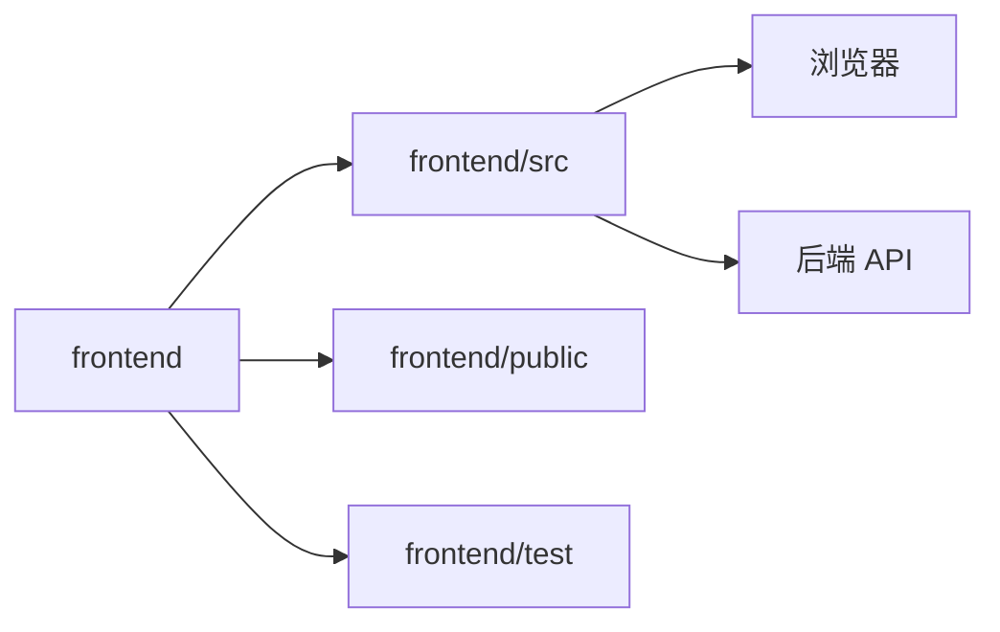

# C4 代码级文档：frontend

## 1. 概述

- **名称**：前端应用
- **描述**：基于 React + TypeScript 的单页应用，使用 Vite 构建。它镜像了内部风险监管系统的 UI、导航与交互行为。
- **位置**：`frontend/`
- **语言**：TypeScript、TSX、CSS、HTML
- **用途**：提供面向用户的原 Web 界面 1:1 克隆，包括登录、仪表盘、股权结构、风险监控、报表、统计、系统管理与审核工作流。

## 2. 关键文件

- `index.html` – 应用 HTML 外壳。
- `package.json` – npm 依赖与脚本（Vite、React、TypeScript、Playwright、Oxlint）。
- `src/` – TypeScript/React 源码与 CSS。见 `c4-code-frontend-src.md`。
- `test/risk-monitor.spec.ts` – Playwright 端到端测试。见 `c4-code-frontend-test.md`。

## 3. 子目录速览

| 目录 | 用途 | 备注 |
|------|------|------|
| `src/` | 应用源码与样式 | 详见 `c4-code-frontend-src.md` |
| `src/assets/` | 源码级静态资产占位 | 实际图片主要从 `public/assets/` 加载 |
| `public/` | Vite 提供的静态目录 | 含 HTML 外壳与图片/字体 |
| `public/assets/` | 背景图、图标、logo 等 UI 图片 | 由 `App.tsx`/`App.css` 引用 |
| `scripts/` | 资源下载脚本等辅助脚本 | 非运行代码 |
| `docs/` | 前端研究与设计规格 | 非运行代码 |
| `test/` | Playwright E2E 测试 | 详见 `c4-code-frontend-test.md` |
| `test-reports/` | Playwright 测试报告 HTML | 构建产物 |
| `dist/` / `test-results/` | 构建与测试结果 | 构建产物，分析时排除 |

## 4. 代码元素

`frontend/` 下没有顶层可执行代码；所有代码位于 `src/` 与 `test/` 下。

## 5. 依赖

- **内部依赖**：`frontend/src/`、`frontend/public/`、`frontend/test/`
- **外部依赖**（来自 `package.json`）：
  - `react ^19.2.8`、`react-dom ^19.2.8`
  - `vite ^8.2.0`、`@vitejs/plugin-react ^6.0.4`
  - `typescript ~6.0.2`、`oxlint ^1.75.0`
  - `@playwright/test ^1.62.1`（开发依赖）

## 6. 关系

