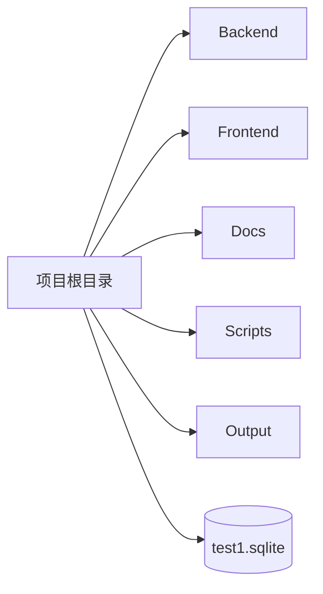

# C4 代码级文档：仓库根目录

## 1. 概述

- **名称**：项目根目录
- **描述**：内部风险监管系统 1:1 克隆项目的顶层目录。包含跨领域说明、构建元数据、导入的 SQLite 数据库以及 `backend`、`frontend`、`docs`、`scripts` 和 `output` 等子项目。
- **位置**：`.`（仓库根目录）
- **语言**：Markdown、JSON、SQLite
- **用途**：定义项目目标、约束，并提供后端使用的共享数据库文件 (`test1.sqlite`)。

## 2. 本目录文件

- `AGENTS.md` – AI 协作说明；禁止 schema 变更、要求 1:1 保真度，并定义源系统的登录凭据。
- `.gitignore` – 排除构建产物、node_modules、SQLite、报告等。
- `package-lock.json` – 空锁文件（前端不使用它，前端有自己的包管理器文件）。
- `test1.sqlite` – 从源系统导入的生产数据库；作为不可变的真相来源。
- `import_err.log` – 导入日志产物。

## 3. 顶层子目录

| 目录 | 用途 | 是否单独成文 |
|------|------|--------------|
| `backend/` | Clojure HTTP API 服务与核心逻辑 | 是，见 `c4-code-backend.md` |
| `frontend/` | React + Vite 前端 SPA | 是，见 `c4-code-frontend.md` |
| `docs/` | 项目文档、研究规格、进度截图、PPT | 是，见 `c4-code-docs.md` |
| `scripts/` | 本地启动脚本（`start-local.sh`） | 否，仅资产/脚本 |
| `output/` / `tmp/` | 构建与临时产物 | 否 |

## 4. 代码元素

根目录层级没有可执行函数。根目录充当编排边界与策略锚点。

## 5. 依赖

- **内部依赖**：`backend/`、`frontend/`、`docs/`、`scripts/`、`output/`、`tmp/`
- **外部依赖**：根目录层级无外部依赖。

## 6. 关系

