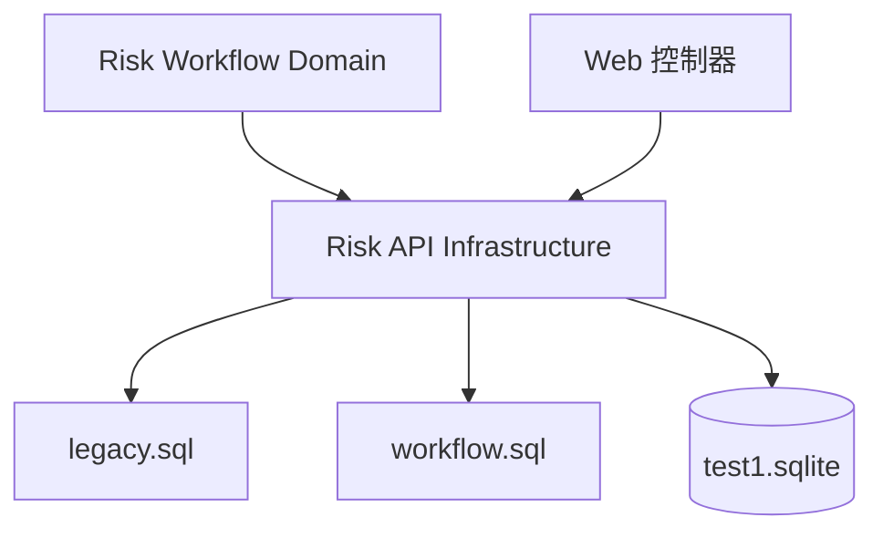

# C4 组件文档：Risk API Infrastructure

## 1. 概述

- **名称**：Risk API Infrastructure
- **描述**：数据库访问层。初始化 SQLite 数据源，提供事务包装器，并将 HugSQL SQL 文件编译为查询函数。
- **类型**：库 / 服务
- **技术栈**：Clojure、Integrant、next.jdbc、HugSQL、SQLite

## 2. 用途

集中所有数据库访问，使领域层和 Web 层无需编写原始 SQL 或管理连接生命周期即可执行查询和事务。该组件遵守项目约束：运行时不会执行 DDL 或迁移。

## 3. 软件功能

- `:risk-api/database` 的 Integrant 生命周期。
- 从 `RISK_API_DB`/`test1.sqlite` 创建数据源。
- 编译 `legacy.sql` 与 `workflow.sql` 的 HugSQL 函数。
- 统一查询选项：小写非限定关键字映射。
- 领域操作的 SQLite 事务包装器。

## 4. 代码元素

- `backend/src/risk_api/infra/database.clj`
- `backend/resources/sql/legacy.sql`
- `backend/resources/sql/workflow.sql`

## 5. 接口

### 内部接口（Clojure 函数）

| 函数 | 输入 | 输出 |
|----------|-------|--------|
| `ig/init-key :risk-api/database` | `{:jdbc-url string}` | `{:jdbc-url, :datasource}` |
| `ig/halt-key! :risk-api/database` | `database` | `nil` |
| `query-opts` | `()` | `{:builder-fn ...}` |
| `transaction!` | `datasource`, `f` | `f` 的结果 |

### 生成的 HugSQL 函数（节选）

`legacy.sql` 与 `workflow.sql` 会生成数十个查询函数。完整列表见代码级文档：
- `list-risks`、`count-risks`、`find-risk-by-id`、`transition-risk-status!`
- `list-enterprises`、`create-enterprise!`、`update-enterprise!`、`delete-enterprise!`
- `list-indicators`、`create-indicator!`、`update-indicator!`、`delete-indicator!`
- `create-manual-risk!`、`create-description-draft!`、`submit-description!`
- `create-confirmation!`、`audit-confirmation!`、`create-legacy-plan-step!`
- `create-legacy-progress!`、`set-risk-plan-state!`、`create-level-change!`、`audit-level-change!`
- `create-operation-log!`、`create-message!`、`list-pending-reviews`、`list-reviewed-reviews`

## 6. 依赖

### 使用的组件
- 无

### 外部系统
- SQLite 数据库 `test1.sqlite`

## 7. 组件图

