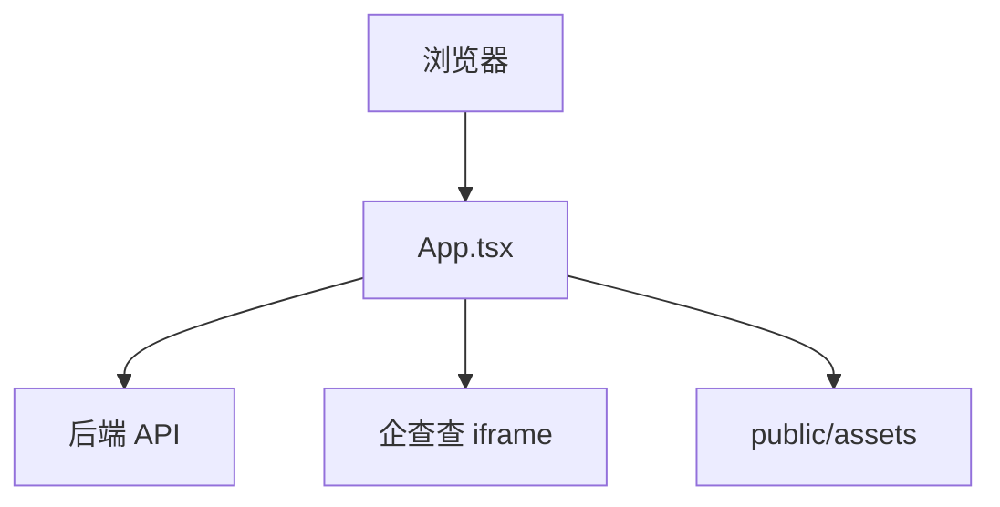

# C4 组件文档：Risk Frontend Shell

## 1. 概述

- **名称**：Risk Frontend Shell
- **描述**：完整复制风险监管平台的 React + TypeScript 用户界面。以单页应用形式实现，采用基于 hash 的路由。
- **类型**：Web 应用
- **技术栈**：React 19、TypeScript、Vite、CSS

## 2. 用途

渲染 1:1 克隆界面：登录页、顶部导航、首页仪表盘、股权结构树、风险监控网格、风险报告、统计分析、系统管理（企业/指标）以及待审核队列。

## 3. 软件功能

- 使用本地管理员凭据的登录页。
- 40px 顶部导航栏，包含六个模块与用户下拉菜单。
- 首页仪表盘展示风险等级汇总与 12 项直接风险类别。
- 股权结构页，集成企查查 iframe。
- 风险信息页，包含高级筛选、级联选择器、表格、分页与操作弹窗。
- 创建手工映射风险的风险录入对话框。
- 风险详情 / 确认 / 消除 / 情况描述弹窗。
- 处置计划与进度编辑器。
- 企业与指标 CRUD 的系统管理页。
- 待审核页面，包含页签、筛选与审核对话框。
- 报表与统计占位页，使用原系统风格的数据表格。
- 响应式断点：1400px、900px、620px。

## 4. 代码元素

- `frontend/index.html`
- `frontend/src/main.tsx`
- `frontend/src/App.tsx`
- `frontend/src/App.css`
- `frontend/src/risk-confirm.css`
- `frontend/src/risk-entry.css`
- `frontend/src/index.css`
- `frontend/public/assets/*`

## 5. 接口

### 用户界面（浏览器）

- 基于 hash 的路由：`#/`、`#/index`、`#/equity`、`#/riskMonitor/info`、`#/riskReport`、`#/statistics`、`#/system`、`#/sys/company`、`#/sys/indicator`、`#/sys/pendingReview`。
- 登录表单：用户名/密码。
- 顶部导航与侧边菜单。
- 筛选控件、数据表格、分页与模态对话框。

### 外部 API 调用

前端调用 `/api/**` 下的后端 REST API。关键端点：
- `POST /api/login`
- `GET /api/supervise/risk/page`
- `POST /api/supervise/risk/:id/description`
- `POST /api/supervise/risk/:id/confirm`
- `POST /api/supervise/risk/:id/elimination`
- `POST /api/supervise/risk/:id/disposal-plans`
- `GET /api/supervise/disposal-steps/:id/progress`
- `GET /api/enterprise/alls`
- `GET /api/sys/dept/list`
- `GET /api/supervise/index/page`
- `GET /api/supervise/risk/export`

## 6. 依赖

### 使用的组件
- 无（单体单文件组件）

### 外部系统
- 后端 API：`http://localhost:8101`（或由 Vite 代理）
- 企查查股权结构 iframe：`https://pro-plugin.qcc.com`
- 浏览器 localStorage，用于登录状态

## 7. 组件图

