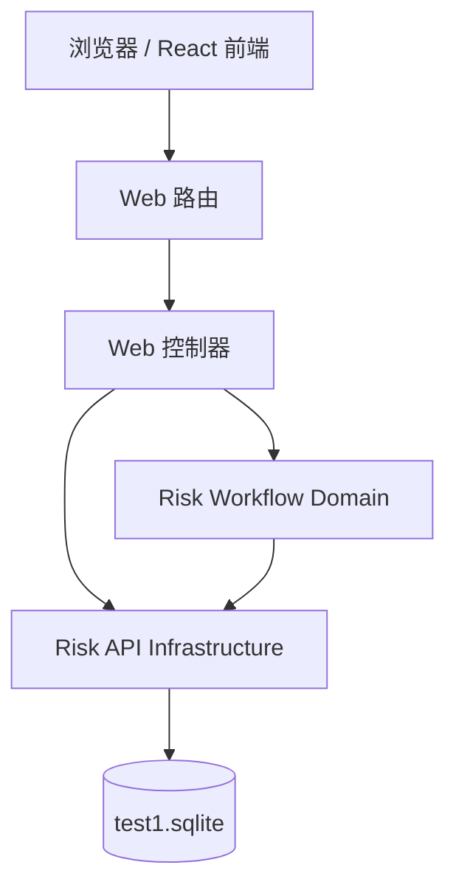

# C4 组件文档：Risk Web API

## 1. 概述

- **名称**：Risk Web API
- **描述**：向后端暴露 HTTP 端点供前端调用的层。负责解析 JSON 请求、分发到领域或基础设施层，并返回兼容旧系统的 JSON 信封。
- **类型**：服务 / Web 应用
- **技术栈**：Clojure、Ring、Reitit、Jetty

## 2. 用途

提供兼容的 REST API，使克隆的 React 前端无需修改即可调用。包含针对 Vite 开发服务器的 CORS 支持、JSON 请求体解析以及原系统所需的所有路由。

## 3. 软件功能

- 登录端点，返回固定的本地 token。
- 风险/企业/指标列表与 CRUD 端点。
- 股权企业树端点。
- 风险导出为 CSV。
- 风险闭环工作流端点（情况描述、确认、审核、处置、消除、等级变更）。
- 描述超时与逾期计划刷新任务端点。
- 审核队列端点（待审核与已审核）。
- 404 处理器，返回兼容旧系统的 JSON 信封。

## 4. 代码元素

- `backend/src/risk_api/web/controller.clj`
- `backend/src/risk_api/web/routes.clj`
- `backend/src/risk_api/core.clj`

## 5. 接口

### REST API（HTTP）

所有响应均采用 `{code, msg, data}` 信封与 JSON 内容类型。

| 方法 | 路径 | 描述 |
|--------|------|-------------|
| POST | `/api/login` | 本地管理员登录 |
| GET | `/api/sys/dept/list` | 部门字典 |
| GET | `/api/enterprise/alls` | 股权企业树 |
| GET | `/api/supervise/risk/page` | 带筛选的风险列表 |
| GET | `/api/supervise/risk/export` | CSV 导出 |
| GET | `/api/supervise/risk/pending-reviews` | 待审核队列 |
| GET | `/api/supervise/risk/reviewed-reviews` | 已审核队列 |
| POST | `/api/supervise/risk/riskHandle` | 旧版风险处理 |
| POST | `/api/supervise/risk/riskSituation` | 旧版情况提交 |
| GET | `/api/supervise/risk/superviseRiskOperationLog/getLogByRiskId` | 操作日志 |
| GET | `/api/demo/superviseriskdisposalplanstep/page` | 处置步骤 |
| POST/PUT | `/api/supervise/enterprise` | 企业创建/更新 |
| GET/POST/DELETE | `/api/supervise/enterprise/:id` | 企业获取/选项/删除 |
| POST/PUT | `/api/supervise/index` | 指标创建/更新 |
| GET/POST/DELETE | `/api/supervise/index/:id` | 指标获取/选项/删除 |
| POST | `/api/supervise/risk/manual` | 创建手工映射风险 |
| POST | `/api/supervise/risk/riskReview` | 旧版风险审核 |
| POST | `/api/supervise/risk/:id/description` | 提交情况描述 |
| POST | `/api/supervise/risk/:id/confirm` | 提交风险确认 |
| POST | `/api/supervise/risk/:id/confirmation-audit` | 审核风险确认 |
| POST | `/api/supervise/risk/dynamics/process` | 处理动态（占位） |
| POST | `/api/supervise/risk/jobs/description-timeout` | 描述超时任务 |
| GET/POST | `/api/supervise/disposal-steps/:id/progress` | 进度列表 / 提交 |
| POST | `/api/supervise/risk/:id/disposal-complete` | 提交计划完成 |
| POST | `/api/supervise/risk/jobs/disposal-overdue` | 逾期计划刷新 |
| POST | `/api/supervise/risk/:id/disposal-audit` | 审核处置完成 |
| POST | `/api/supervise/risk/:id/elimination` | 申请风险消除 |
| POST | `/api/supervise/risk/:id/elimination-audit` | 审核风险消除 |
| POST | `/api/supervise/risk/:id/level-changes` | 申请风险等级变更 |
| POST | `/api/supervise/risk/:id/level-change-audit` | 审核风险等级变更 |
| POST | `/api/supervise/risk/:id/disposal-plans` | 创建处置计划 |

## 6. 依赖

### 使用的组件
- Risk Workflow Domain
- Risk API Infrastructure

### 外部系统
- Jetty HTTP 服务器
- 浏览器 / React 前端

## 7. 组件图

