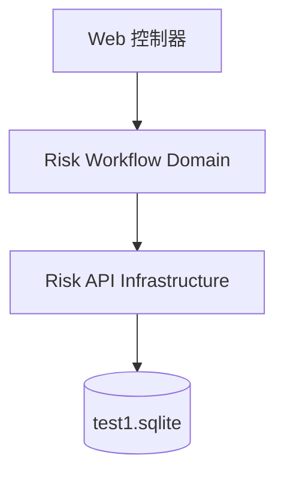

# C4 组件文档：Risk Workflow Domain

## 1. 概述

- **名称**：Risk Workflow Domain
- **描述**：实现风险监管闭环工作流的业务状态机：情况描述、确认、审核、处置计划、进度跟踪、完成审核、消除与等级变更。
- **类型**：库 / 服务
- **技术栈**：Clojure、SQLite（通过 HugSQL）、Integrant

## 2. 用途

该领域组件强制执行 1:1 克隆风险监管流程的规则：
1. 手工映射的风险按正确初始状态创建。
2. 二级企业进入“情况描述”步骤，并带有 3 天截止日期。
3. 主责部门确认或关闭风险；法务/风控审核该决定。
4. 已确认风险接收处置计划，包含步骤与责任人。
5. 进度更新驱动步骤与计划状态变化。
6. 完成的计划需经审核；审核通过后触发风险消除申请。
7. 消除与等级变更申请需经审核。

所有状态转换都记录在 `supervise_risk_operation_log` 中，待办消息写入 `supervise_message_record`。

## 3. 软件功能

- 创建并校验手工映射风险。
- 初始化并提交情况描述。
- 自动超时情况描述草稿。
- 提交并审核风险确认（是风险 / 不是风险）。
- 创建/变更处置计划与步骤。
- 提交处置进度并标记步骤完成。
- 提交并审核处置完成。
- 申请并审核风险消除。
- 申请并审核风险等级变更。
- 刷新逾期计划并标记为延期。
- 在审计日志中记录每次操作。

## 4. 代码元素

- `backend/src/risk_api/domain/workflow.clj`
- `backend/resources/sql/workflow.sql`
- `backend/test/risk_api/workflow_test.clj`

## 5. 接口

### 内部接口（Clojure 函数）

所有函数均接收 datasource 与 params/body 映射；返回 `{:code 0 :msg "success" :data ...}` 或 `{:code 500 :msg ...}`。

| 函数 | 输入 | 输出 |
|----------|-------|--------|
| `create-manual-risk!` | `datasource`, `risk` map | `{:riskId, :operationStatus}` |
| `initialize-description!` | `datasource`, `risk-id`, `due-at` | `{:riskId, :operationStatus}` |
| `submit-description!` | `datasource`, `risk-id`, `body` | `{:riskId, :operationStatus}` |
| `timeout-descriptions!` | `datasource`, `_` | `{:processed count}` |
| `submit-confirmation!` | `datasource`, `risk-id`, `body` | `{:riskId, :operationStatus}` |
| `audit-confirmation!` | `datasource`, `risk-id`, `body` | `{:riskId, :operationStatus}` |
| `risk-review!` | `datasource`, `body` | 同 audit-confirmation! |
| `create-plan!` | `datasource`, `risk-id`, `body` | `{:planNo, :disposalStatus}` |
| `submit-progress!` | `datasource`, `step-id`, `body` | `{:stepId, :disposalStatus}` |
| `submit-plan-completion!` | `datasource`, `risk-id`, `body` | `{:riskId, :disposalStatus}` |
| `audit-disposal!` | `datasource`, `risk-id`, `body` | `{:riskId, :disposalStatus}` |
| `request-elimination!` | `datasource`, `risk-id`, `body` | `{:riskId, :operationStatus}` |
| `audit-elimination!` | `datasource`, `risk-id`, `body` | `{:riskId, :operationStatus}` |
| `request-level-change!` | `datasource`, `risk-id`, `body` | `{:riskId}` |
| `audit-level-change!` | `datasource`, `risk-id`, `body` | `{:riskId, :approved}` |
| `refresh-overdue-plans!` | `datasource`, `_` | `{:processed count}` |

## 6. 依赖

### 使用的组件
- Risk API Infrastructure（数据库、事务、HugSQL 函数）

### 外部系统
- SQLite 数据库 `test1.sqlite`

## 7. 组件图

