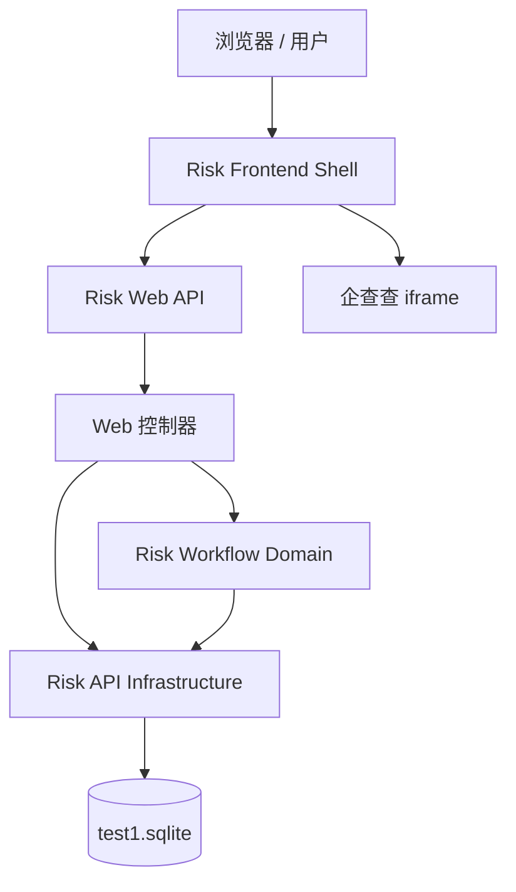

# C4 组件索引

## 1. 系统组件

| 组件 | 简短描述 | 链接 |
|-----------|-------------------|------|
| Risk Web API | 基于 Clojure、Ring、Reitit 和 Jetty 构建的 HTTP/REST API 层。 | [c4-component-risk-web-api.md](c4-component-risk-web-api.md) |
| Risk Workflow Domain | 完整风险闭环工作流的业务状态机。 | [c4-component-risk-workflow-domain.md](c4-component-risk-workflow-domain.md) |
| Risk API Infrastructure | 使用 next.jdbc、HugSQL 和 SQLite 的数据库访问层。 | [c4-component-risk-api-infrastructure.md](c4-component-risk-api-infrastructure.md) |
| Risk Frontend Shell | 克隆原系统 UI 的 React + TypeScript 单页应用。 | [c4-component-risk-frontend-shell.md](c4-component-risk-frontend-shell.md) |

## 2. 组件关系图

## 3. 说明

- 前端是一个整体的 React 组件，位于 `App.tsx`；它直接与 Web API 通信。
- Web API 组件将工作流操作委托给 Risk Workflow Domain 组件。
- Web API 和 Risk Workflow Domain 均使用 Risk API Infrastructure 组件进行持久化。
- SQLite 数据库 `test1.sqlite` 是唯一的真相来源，且被视为不可变；运行时不会执行 schema 迁移。
