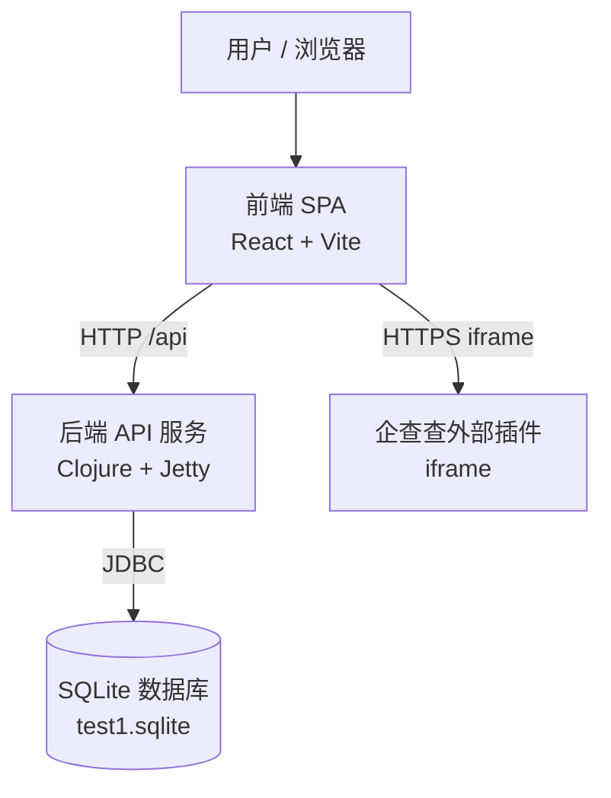

# C4 容器文档

## 1. 容器

### 1.1 后端 API 服务

- **名称**：后端 API 服务
- **描述**：Clojure/Jetty HTTP 服务，暴露兼容旧系统的 REST API 及风险闭环工作流。
- **类型**：API
- **技术栈**：Clojure 1.12、Integrant、Ring、Reitit、Jetty、SQLite（通过 next.jdbc + HugSQL）
- **部署**：在 `backend/` 目录下通过 `clojure -M:run` 作为独立 JVM 进程运行。默认地址为 `http://localhost:8101`。环境变量：`PORT`、`RISK_API_DB`。
- **组件**：Risk Web API、Risk Workflow Domain、Risk API Infrastructure。

### 1.2 前端 SPA

- **名称**：前端 SPA
- **描述**：基于 React + TypeScript 的单页应用，由 Vite 提供服务，是面向用户的原系统克隆界面。
- **类型**：Web 应用
- **技术栈**：React 19、TypeScript、Vite、CSS
- **部署**：开发期通过 `npm run dev`（`http://localhost:5173`）；生产环境通过 `npm run build` 与 `npm run preview`。
- **组件**：Risk Frontend Shell。

### 1.3 SQLite 数据库

- **名称**：SQLite 数据库
- **描述**：导入的 `test1.sqlite` 数据库文件，包含旧 schema 与数据，是唯一的持久化存储。
- **类型**：数据库
- **技术栈**：SQLite 3（通过 `org.xerial/sqlite-jdbc` 访问）
- **部署**：本地文件系统中的文件，由后端服务引用。
- **组件**：（仅查询）Risk API Infrastructure。

### 1.4 企查查外部插件

- **名称**：企查查外部插件
- **描述**：用于渲染企业股权结构图的外部 iframe 服务。不属于本代码库的一部分。
- **类型**：外部服务
- **技术栈**：与 `https://pro-plugin.qcc.com` 的浏览器 iframe 集成
- **部署**：第三方 SaaS。
- **组件**：无

## 2. 用途

本容器视图展示本地克隆的部署与运行时边界。后端 API 服务与前端 SPA 是两个独立运行的进程；它们通过 HTTP 通信，后端读取共享的 SQLite 文件。前端通过 iframe 嵌入外部企查查服务以展示股权结构。

## 3. 每个容器包含的组件

| 容器 | 组件 |
|-----------|-----------|
| 后端 API 服务 | Risk Web API、Risk Workflow Domain、Risk API Infrastructure |
| 前端 SPA | Risk Frontend Shell |
| SQLite 数据库 | （持久化存储） |
| 企查查外部插件 | （外部） |

## 4. 接口

### 4.1 后端 API 服务

- **协议**：HTTP/REST
- **基础 URL**：`http://localhost:8101`
- **OpenAPI 规范**：[apis/backend-api.yaml](apis/backend-api.yaml)
- **认证**：基于 Token，通过 `Authorization` 与 `token` 请求头传递；当前本地实现由 `/api/login` 返回固定 token，且不校验 token。
- **CORS**：允许 Vite 开发服务器来源 `http://localhost:5173`。

### 4.2 前端 SPA

- **协议**：HTTP（由 Vite 提供）及用于企查查的 HTTPS iframe。
- **基础 URL**：开发环境 `http://localhost:5173`，构建后为静态文件。
- **路由**：基于 hash 的 SPA 路由（`#/`、`#/equity`、`#/riskMonitor/info`、`#/system` 等）。

### 4.3 SQLite 数据库

- **协议**：JDBC/SQLite 文件
- **连接字符串**：`jdbc:sqlite:<path>`（默认相对于 `backend/` 为 `../test1.sqlite`）

### 4.4 企查查外部插件

- **协议**：HTTPS iframe
- **URL 模式**：`https://pro-plugin.qcc.com/charts/stockstructure?keyNo=<qccId>`

## 5. API 规范

详见 [apis/backend-api.yaml](apis/backend-api.yaml) 中的后端 API 服务 OpenAPI 3.1 规范。

## 6. 依赖

| 容器 | 依赖 | 协议 |
|-----------|-----------|----------|
| 后端 API 服务 | SQLite 数据库 | JDBC |
| 前端 SPA | 后端 API 服务 | HTTP（REST + JSON） |
| 前端 SPA | 企查查外部插件 | HTTPS iframe |

## 7. 基础设施

- **后端**：通过 `cd backend && clojure -M:run` 运行。端口可通过 `PORT` 配置；数据库路径可通过 `RISK_API_DB` 配置。
- **前端**：通过 `cd frontend && npm run dev` 运行（端口 5173），或通过 `npm run build` + `npm run preview` 进行生产预览。
- **数据库**：`test1.sqlite` 必须存在于项目根目录，或 `RISK_API_DB` 指向的路径。
- **无容器编排文件**（Docker、K8s 等）。当前部署基于本地开发进程。

## 8. 容器图

