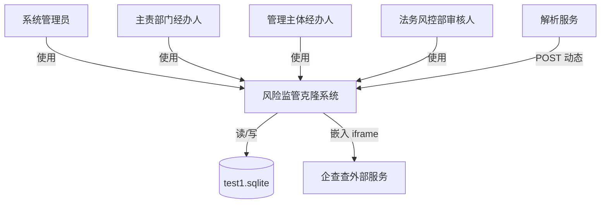

# C4 上下文文档

## 1. 系统概述

- **简短描述**：内部风险监管平台的 1:1 本地克隆，用于监控企业风险，驱动闭环评审/处置流程，并提供仪表盘、报表和系统管理功能。
- **详细描述**：本系统复刻了原“华企通穿透式监管平台”，用于监管集团下属企业（全资、控股、参股、基金/SPV 及集团总部）。系统摄取或手工录入风险指标，依次经过情况描述、确认、审核、处置计划、进度跟踪、完成审核、消除审核等流程，并提供仪表盘、报表、企业/指标管理以及审核队列。本地克隆采用 React 前端和 Clojure 后端，读取已导入的 `test1.sqlite` 数据库，且不修改其 schema。

## 2. 角色

| 角色 | 类型 | 描述 | 目标 | 使用的关键功能 |
|---------|------|-------------|-------|-------------------|
| 系统管理员 (System Admin) | 人类用户 | 以 `admin` 身份登录，浏览系统并验证克隆保真度。 | 登录、浏览各模块、查看数据、验证 UI/UX | 登录、顶部导航、首页仪表盘、所有模块 |
| 主责部门经办人 (Responsible Department Operator) | 人类用户 | 确认风险是否真实、创建处置计划、审核处置完成。 | 确认风险、制定处置计划、审核完成 | 风险信息页、确认对话框、处置计划对话框、待审核 |
| 管理主体经办人 (Managing Subject Operator) | 人类用户 | 填写情况描述、执行处置计划、维护进度。 | 提交情况描述、维护进度、完成处置 | 情况描述对话框、进度更新对话框 |
| 法务风控部审核人 (Legal / Risk Control Auditor) | 人类用户 | 审核风险确认、消除及等级变更。 | 审核确认/消除/等级变更请求 | 我的审核页面、审核对话框 |
| 系统解析服务 (Parsing Service) | 程序化用户 | （规划中）消费外部风险动态，匹配企业与指标并创建风险记录。 | 接收动态、解析、创建风险 | `POST /api/supervise/risk/dynamics/process`（占位） |
| 企查查 (QCC) | 外部系统 | 通过公开网站/API 提供企业股权结构与风险数据。 | 提供数据及股权图谱 | 股权 iframe、外部数据源 |

## 3. 系统功能

| 功能 | 描述 | 用户 | 旅程链接 |
|---------|-------------|-------|--------------|
| 登录与导航 (Login & Navigation) | 管理员登录、顶部菜单导航、退出下拉。 | 系统管理员 | 旅程 1 |
| 首页仪表盘 (Home Dashboard) | 风险等级汇总与 12 项直接风险类别。 | 系统管理员 | 旅程 2 |
| 股权结构 (Equity Structure) | 组织架构树与企查查股权 iframe。 | 系统管理员 | 旅程 3 |
| 风险监控 (Risk Monitoring) | 风险列表，支持筛选、分页、详情、确认、情况、消除、处置计划及全景。 | 主责部门经办人、管理主体经办人、法务审核人 | 旅程 4 |
| 风险报告 (Risk Reports) | 季度/年度报表占位。 | 系统管理员 | 旅程 5 |
| 统计分析 (Statistics & Analytics) | 汇总卡片、风险等级分布、风险类型柱状图。 | 系统管理员 | 旅程 6 |
| 系统管理 (System Management) | 企业与指标的增删改查、风险等级设置。 | 系统管理员 | 旅程 7 |
| 我的审核 (My Reviews) | 确认、等级变更、处置完成、动态调整等待审核/已审核页签。 | 法务审核人、主责部门经办人 | 旅程 8 |

## 4. 用户旅程

### 旅程 1：系统管理员——登录并浏览模块
1. 打开应用 URL。
2. 在登录页输入用户名 `admin` 和密码 `admin`。
3. 点击登录；系统保存登录状态并跳转至首页仪表盘。
4. 点击顶部菜单项（首页、股权结构、风险监控、风险报告、统计分析、系统管理）。
5. 外壳渲染所选模块页面。

### 旅程 2：系统管理员——查看首页仪表盘
1. 登录后进入首页仪表盘。
2. 查看主横幅、搜索框及三张风险等级卡片。
3. 点击 12 个直接风险类别卡片之一。
4. 系统高亮或导航至对应风险类别（UI 演示）。

### 旅程 3：系统管理员——浏览股权结构
1. 点击顶部菜单“股权结构”。
2. 左侧面板从 `/api/enterprise/alls` 加载企业组织架构树。
3. 选择某个企业节点。
4. 右侧 iframe 加载 `https://pro-plugin.qcc.com/charts/stockstructure?keyNo=<qccId>`。

### 旅程 4：管理主体经办人——提交情况描述
1. 导航至 风险监控 > 风险信息。
2. 找到状态为“情况描述 (7)”的风险。
3. 点击“情况描述”操作。
4. 填写发生原因、决策机构、是否报备集团及报备内容。
5. 点击提交；前端调用 `POST /api/supervise/risk/{id}/description`。
6. 后端将风险状态转为“未确认 (0)”并记录操作日志。

### 旅程 5：主责部门经办人——确认风险
1. 导航至 风险监控 > 风险信息。
2. 找到状态为“未确认 (0)”的风险。
3. 点击“风险确认”。
4. 选择“是风险”或“不是风险”并填写备注。
5. 点击提交；前端调用 `POST /api/supervise/risk/{id}/confirm`。
6. 后端将状态转为“确认待审核 (4)”或“关闭待审核 (5)”并创建法务审核待办。

### 旅程 6：法务审核人——审核确认
1. 导航至 系统管理 > 我的审核（待审核）。
2. 选择“风险状态审核”页签。
3. 点击某条待审核记录的“审核”。
4. 查看详情及操作日志。
5. 选择“同意”或“不同意”，填写原因并点击确定。
6. 前端调用 `POST /api/supervise/risk/{id}/confirmation-audit`。
7. 后端将状态转为“已确认 (1)”或“已关闭 (3)”。

### 旅程 7：主责部门经办人——创建处置计划
1. 导航至 风险监控 > 风险信息。
2. 找到一条“已确认 (1)”且尚无计划的风险。
3. 点击“处置计划”。
4. 填写计划总目标、计划截止日期及一个或多个步骤。
5. 点击保存；前端调用 `POST /api/supervise/risk/{id}/disposal-plans`。
6. 后端持久化计划步骤并将计划状态设为未开始。

### 旅程 8：管理主体经办人——更新进度并完成处置
1. 导航至已确认风险的处置计划。
2. 点击某步骤的“开始执行”。
3. 填写进度内容并选择“申请完成”。
4. 点击保存；前端调用 `POST /api/supervise/disposal-steps/{id}/progress`。
5. 当所有步骤完成时，前端或后端自动调用 `POST /api/supervise/risk/{id}/disposal-complete`。
6. 风险移至“完成待审核 (3)”，特殊企业则直接到“消除待审核 (6)”。

### 旅程 9：法务审核人——审核消除
1. 打开待审核页面，“风险状态审核”页签。
2. 找到状态为“消除待审核 (6)”的风险。
3. 点击“审核”，查看处置计划与进度，选择“同意”。
4. 前端调用 `POST /api/supervise/risk/{id}/elimination-audit`。
5. 后端将状态转为“已消除 (2)”。

### 旅程 10：系统管理员——管理企业或指标
1. 导航至 系统管理 > 企业管理 或 指标管理。
2. 查看来自 `/api/supervise/enterprise/page` 或 `/api/supervise/index/page` 的分页列表。
3. 点击“新增”打开表单，填写字段后点击确认。
4. 前端调用 `POST /api/supervise/enterprise` 或 `POST /api/supervise/index`。
5. 后端向 `test1.sqlite` 插入新记录。

## 5. 外部系统与依赖

| 系统 | 类型 | 描述 | 集成方式 | 用途 |
|--------|------|-------------|-------------|---------|
| SQLite (`test1.sqlite`) | 数据库 | 从原系统导入的生产数据库。 | JDBC 文件访问 | 克隆项目的全部持久化；schema 不可变。 |
| 企查查 (QCC) | 外部服务 | 企业信息与股权结构图。 | HTTPS iframe 及原始数据源 | 提供股权 iframe 及原始风险动态。 |
| Vite 开发服务器 | 开发工具 | 开发期间为前端提供服务。 | HTTP，端口 5173 | 本地前端开发与预览。 |

## 6. 系统上下文图

## 7. 相关文档

- [c4-container.md](c4-container.md) – 容器级部署与 API 详情。
- [c4-component.md](c4-component.md) – 组件索引与关系。
- [c4-component-risk-web-api.md](c4-component-risk-web-api.md) – Web API 组件详情。
- [c4-component-risk-workflow-domain.md](c4-component-risk-workflow-domain.md) – 工作流领域详情。
- [c4-component-risk-api-infrastructure.md](c4-component-risk-api-infrastructure.md) – 数据库基础设施详情。
- [c4-component-risk-frontend-shell.md](c4-component-risk-frontend-shell.md) – 前端外壳详情。
- [apis/backend-api.yaml](apis/backend-api.yaml) – 后端 API 的 OpenAPI 规范。
