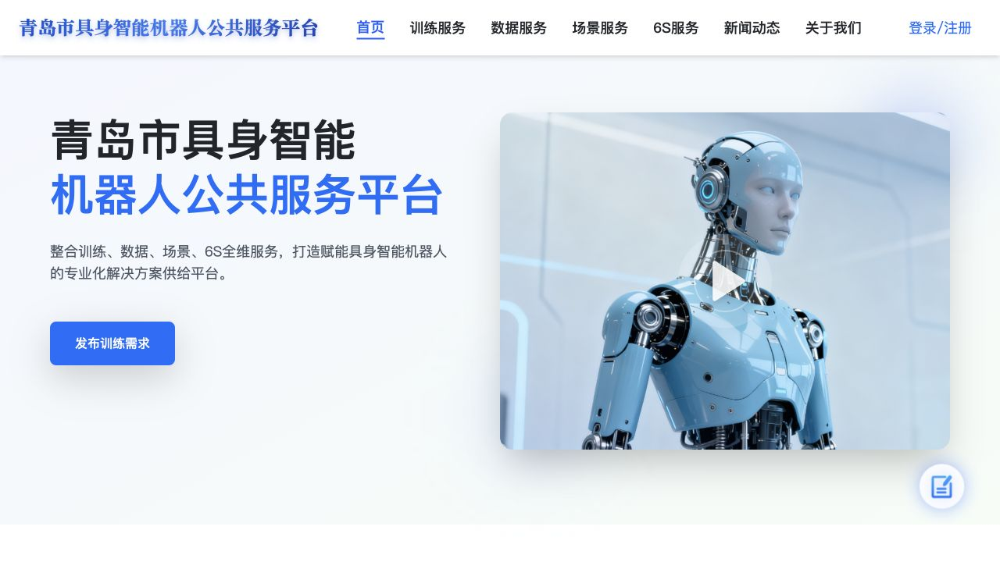
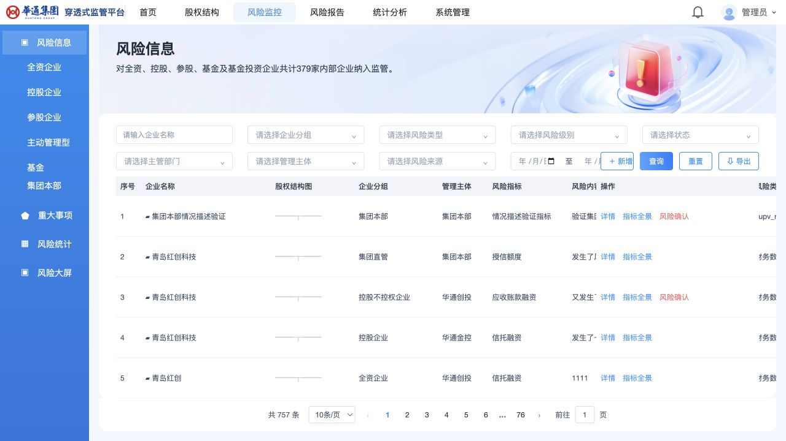
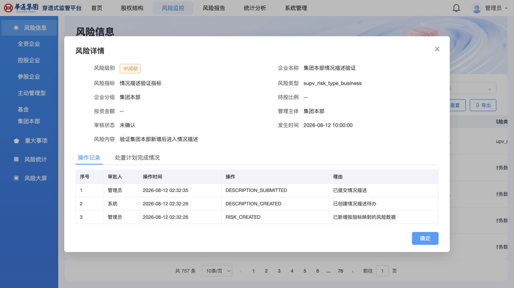
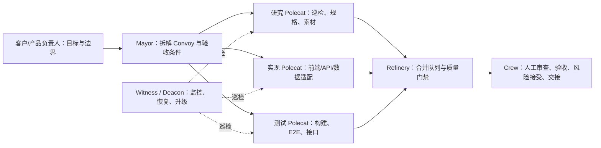

# 青岛红创｜Gastown 多 Agent AI 开发平台实证报告

> **报告目的**：以三个真实项目说明，青岛红创基于 **Gastown 包装版**建设的 AI 开发平台，如何把无源码项目/遗留项目的理解、实现、验证和交接，变成可追溯、可监管、可复制的交付链路。
> **主实践样本**：穿透式监管平台 1:1 复刻（本仓库）
> **报告更新**：2026-08-13
> **本地演示**：<http://localhost:5173/>

---

## 阅读方式：一条从困境到验证的故事线

> **客户面对看不懂、改不动、验不清的系统** → **三组真实项目先证明平台已经能复刻、接手与治理** → **再解释 Gastown 多 Agent 如何把这些工作组织成可并行、可监管的流程** → **质量证据建立信任** → **以受控试点进入客户项目。**

| 章节 | 建议 PPT 页数 | 本章重点 | 与下一章的衔接 |
| --- | ---: | --- | --- |
| 第一章：为什么需要平台 | 2 页 | 客户真正需要的是需求验证自由与可维护性 | 先用实践结论回答“平台已经证明了什么” |
| 第二章：三组项目实践的递进验证 | 6 页 | 从网站复刻到管理后台复刻，再到遗留系统接手治理 | 再解释支撑这些结果的 Gastown 协作机制 |
| 第三章：Gastown 如何工作 | 3 页 | 多 Agent 如何分工、隔离、监控与合并 | 机制必须进入质量门禁，才能形成客户信任 |
| 第四章：质量与信任 | 3 页 | AI 代码为何可信、如何持续维护 | 收束为客户可启动的受控试点 |
| 第五章：客户落地路径 | 2 页 | 如何建立“导入—验证—交接”首个闭环 | 进入项目执行 |

---

# 第一章｜为什么客户需要的不是“再外包一个项目”

## 1.1 客户被等待、沟通和交接锁住

面对无源码系统、长期运行的管理后台或需要快速验证的新需求，传统交付有三类高成本：

| 成本 | 传统表现 | 业务后果 |
| --- | --- | --- |
| 理解成本 | 页面、数据库和业务规则分散在人员记忆、旧系统和多份文档中 | 新人接手慢，需求反复确认 |
| 实现成本 | 前端、后端、测试、文档串行交接 | 等待时间长，问题集中到联调末期 |
| 信任成本 | 改动影响、代码质量和责任边界难以量化 | 客户不敢让 AI 或新团队直接接手 |

客户真正购买的不是“一次代码生成”，而是：

> **在不牺牲可审查性和数据安全的前提下，更早看见可运行成果、更快验证需求，并能持续维护。**

这就是“需求自由”：业务方不用等待完整传统立项结束，先以可运行版本确认页面、流程和数据口径，再决定生产化投入。

## 1.2 平台的承诺边界：短平快，但不偷换成生产重建

本次主样本定位为**纯前端复刻优先**：先抓取网页结构、视觉、文案、素材和可观察交互，生成可运行的管理后台；必要时再提供本地 API 兼容层展示数据闭环。

| 适合先用平台验证的需求 | 不应直接宣称完成的事项 |
| --- | --- |
| 旧系统界面复刻、管理后台展示、内部工具、产品原型、迁移前流程确认 | 生产级安全、全量权限、全量接口、性能压测、灾备、生产上线 |

**结论先行**：平台不是概念验证。先看三个从易到难的真实项目，确认它已经交付了哪些可核验结果；随后再解释这些结果背后的 Gastown 多 Agent 协作机制。

---

# 第二章｜三组项目实践的递进验证：从复刻到接手治理

这一章把三个项目放在同一条难度阶梯中比较：先证明可以复刻一个公开网站，再证明可以在严格数据边界下复刻企业级管理后台，最后证明可以接手有源码的遗留系统并形成治理计划。

| 实践阶梯 | 项目 | 难度与约束 | 平台证明的能力 |
| --- | --- | --- | --- |
| 1. 网站复刻 | 青岛市具身智能机器人公共服务平台 | 多路由、素材本地化、公开站点交互与展示一致性 | 快速巡检、静态资源镜像、页面/路由复刻 |
| 2. 管理后台复刻 | 穿透式监管平台 | 只读原系统、81 张既有表、风险流程与本地兼容 API | 规格取证、数据边界保护、复杂表单/流程实现 |
| 3. 旧项目接手 | 人人项目 | 复杂源码、技术债、热点、耦合与人员依赖 | 架构理解、代码监管、整改计划与知识转移 |

## 2.1 第一阶：公开网站 1:1 复刻——机器人公共服务平台

原站为 [青岛市具身智能机器人公共服务平台](https://qdairobot.cn/)。其本地复刻项目位于 `/Users/mahaiqiang/git/redcreation/robot_site/`，覆盖首页、训练服务、数据服务、场景服务、新闻、关于我们等发布路由，以及登录/注册弹窗和本地市场数据适配。

> 2026-08-13 尝试采集原站截图时，浏览器因 HTTPS 证书日期失效而拒绝加载；未绕过安全拦截。下图使用本地复刻项目的首页运行截图，作为可运行证据；原站同视口截图应在证书恢复后补入视觉对比档案。

| 已验证结果 | 说明 |
| --- | --- |
| 29 个本地静态资产 | 原始发布 JS/CSS、favicon 与 26 张页面图片已本地化 |
| 15 条发布路由 | 均返回页面内容，测试记录未发现控制台错误 |
| 核心交互 | 首页、顶部菜单、页脚、登录/注册弹窗、数据服务卡片/详情/购买入口可用 |
| 本地数据适配 | 数据交易、训练、场景、供需市场已验证本地接口回归 |

**这一阶的结论**：对于公开展示站点，平台能把“网页巡检—素材本地化—前端镜像—路由验证”快速串成闭环。下一阶不再只是页面一致，而要面对既有数据库和企业级流程约束。

## 2.2 第二阶：企业级管理后台复刻——起点与约束

| 项目项 | 本次实践事实 |
| --- | --- |
| 目标 | 将内部穿透式监管系统复刻为本地可独立运行的演示版本 |
| 原系统边界 | 只允许登录、只读浏览和界面取证；禁止创建、修改、删除原系统业务数据 |
| 数据边界 | 使用既有 `test1.sqlite` 中的原表和现有数据；禁止建表、迁移、改表或重建数据 |
| 本地运行 | 前端 `frontend/`，<http://localhost:5173/>；本地 API 兼容层 `backend/`，默认 `http://localhost:8101` |
| 当前定位 | 前端复刻优先；本地 API 用于演示数据/风险闭环，不等同于生产后端重建 |

## 2.3 第二阶：把“看见”变成可执行规格

在 Gastown 的任务拆分中，研究类工作不与编码混在一起：页面拓扑、行为、组件/弹窗规格、真实文案和本地素材先沉淀，再交给实现任务。

| 已沉淀的事实资产 | 当前数量/位置 | 为什么重要 |
| --- | --- | --- |
| 研究/规格文档 | 9 份，位于 `docs/research/`、`frontend/docs/research/` | 编码、验收和交接有共同依据 |
| 本地 PNG/SVG 素材 | 29 个，位于 `frontend/public/` | 展示不依赖原系统运行时 URL |
| 进度/视觉截图 | 9 张，位于 `docs/progress-assets/` | 可核验本地演示状态 |
| 既有数据库表 | 81 张表 | 数据适配必须以原表为事实来源 |

## 2.4 第二阶：把规格变成可运行闭环

| 页面/能力 | 状态 | 已实现内容 |
| --- | --- | --- |
| 登录、首页、股权结构 | 已实现 | 登录态、导航、企业树/结构图展示 |
| 风险信息工作台 | 已实现并已取证 | 组合筛选、分页、导出、新增、详情、指标全景和状态动作 |
| 风险闭环弹窗 | 已实现 | 情况描述、确认、消除、处置计划和详情；入口受记录状态控制 |
| 企业管理、指标管理、待审核 | 已实现 | CRUD/审核页面结构与交互 |
| 风险报告、统计分析 | 框架态 | 路由和页面骨架存在，部分数据仍为静态占位 |

当前可盘点：前端 6 个 TS/TSX/CSS 源文件、后端 5 个 Clojure 源文件；前端、后端和 SQL 合计 **5,270 行**；本地后端定义 31 条路径、38 个 HTTP 操作。

## 2.5 第二阶：本地演示证明“不是设计稿”

2026-08-13 的本地取证显示：风险工作台已加载 **757 条**既有风险记录；风险详情弹窗可展示风险字段、状态、处置记录和操作历史。

| 风险监控工作台 | 风险详情弹窗 |
| --- | --- |
|  |  |

这一步回答“AI 是否真的做出了可运行系统”。但它还不能回答“是否已经 100% 像素级 1:1 验收”。该问题必须进入质量门禁，而不是混在成果展示中。

---

## 2.6 第三阶：有源码遗留系统接手——人人项目

`/Users/mahaiqiang/git/redcreation/renren-security/` 展示的是另一类实践：不从页面复刻开始，而是先建立旧系统的共同语言、识别维护成本，并把分析转为可执行的整改计划。

| 已取证结果 | 对应执行动作 |
| --- | --- |
| 已生成 C4 上下文、容器、组件、认证、系统管理、日志、任务、OSS 等架构文档 | 新团队先拥有共同语言、模块地图和依赖视图 |
| XRay 分析窗口内 3 次提交、总 churn 78,117、677 个热点/风险文件；最活跃目录为 `renren-ui/src` | 为热点目录配置专项 owner、回归脚本和 review 门槛 |
| 高变更样式热点：`theme/index.less` churn 1,870、`app.less` churn 1,134，均在窗口内变更 2 次 | P0：先画依赖、补测试、做双人 review，再拆职责 |
| 热点文件由单人主导（Top1 归属 100%）；分析窗口内仅 1 位活跃作者 | P0：建立 backup owner 和轮换 review，降低知识孤岛风险 |

## 2.7 递进比较：三个项目共同证明什么

| 对比维度 | 机器人网站复刻 | 监管平台复刻 | 人人旧项目接手 |
| --- | --- | --- |
| 起点 | 公网站点与静态资源 | 只读企业系统与既有数据 | 有源码但认知/维护成本高 |
| 关键挑战 | 页面、素材、路由和交互镜像 | 数据库零侵入、复杂表单、风险流程 | 架构复杂度、热点耦合、知识孤岛 |
| Gastown 的主要协同方式 | 研究与前端复刻并行，验证任务独立 | 研究、前端、数据/API、测试按边界协同 | 分析、C4 文档、XRay 取证和整改计划协同 |
| 可交付物 | 本地站点、资源映射、路由验证 | 本地后台、规格、数据适配、测试与截图 | 架构地图、风险报告、优先级整改任务 |
| 证明的能力 | **快速复刻** | **复杂复刻** | **安全接手与持续治理** |

**本章结论**：三个项目不是三段孤立佐证，而是一条从易到难的能力阶梯。平台先证明能复刻“看得见的网页”，再证明能在数据边界内复刻“看得见且能操作的企业业务”，最终证明能看懂并治理“看不见、但必须维护的旧代码”。

---

# 第三章｜Gastown 多 Agent：把并行开发变成可管理的生产线

## 3.1 我们的平台底座：Gastown 包装版

青岛红创的平台采用 **Gastown 包装版**作为多 Agent 协作与工作空间管理底座；在其上叠加项目规范、模板、代码质量门禁、复刻流程和交接标准。Gastown 的重点不是“多开几个模型窗口”，而是将任务拆解、隔离执行、状态跟踪、异常升级与合并验证放在同一套机制中。

> 下表的角色与机制来自 Gastown 的公开设计；我司包装版将其配置为面向客户项目的交付流程、权限边界和质量模板。[Gastown 官方项目说明](https://github.com/gastownhall/gastown) ｜ [官方术语表](https://github.com/gastownhall/gastown/blob/main/docs/glossary.md)

| Gastown 角色 | 我司平台中的职责 | 节省的人力不是“少了谁”，而是少了什么重复劳动 |
| --- | --- | --- |
| **Mayor**（总协调 Agent） | 读取目标、拆任务、建立 Convoy、分派研究/实现/测试任务、汇总结果 | 反复拆任务、催进度、转述上下文 |
| **Polecat**（执行 Agent） | 在隔离 Git worktree 中完成边界清晰的研究、前端、接口、测试或文档任务 | 多个独立工作包可并行，避免相互覆盖 |
| **Witness**（项目巡检） | 监控本项目执行 Agent 的卡住、超时、完成与清理状态 | 人工盯屏、发现任务失联、重复追问 |
| **Deacon**（跨项目巡检） | 跨项目持续健康检查、异常升级和维护调度 | 多项目并行时的协调盲区 |
| **Refinery**（合并验证） | 汇集完成分支，执行构建/测试门禁；失败时定位不通过改动 | Agent 直接改主线、集成风险后置 |
| **Crew**（人类工作区） | 产品/技术负责人做范围决策、代码审查和最终验收 | 把人的时间集中在判断，而非复制粘贴和状态同步 |

## 3.2 平台工作流：从需求到可审查变更

工作单元以 Git worktree 隔离，完成后经合并队列验证，而不是由执行 Agent 直接进入主分支；卡住的任务通过升级机制暴露给协调/人工角色。这样，多任务可以并行，但版本、回滚和责任轨迹不丢失。[Gastown 的工作流与合并队列说明](https://github.com/gastownhall/gastown)

## 3.3 多 Agent 如何节省人力

节省的关键不是减少所有人，而是减少**等待、状态同步、重复上下文输入和返工**。

| 工作 | 单线程传统方式 | Gastown 多 Agent 方式 | 人类保留的职责 |
| --- | --- | --- | --- |
| 原系统巡检与规格 | 开发者边看边写，项目末期再补文档 | 研究任务独立取证，规格先产出 | 确认范围与事实 |
| 前端、数据适配、测试 | 依次排队 | 依赖明确的工作包并行，Mayor 统一协调 | 审查接口与数据边界 |
| 进度跟踪 | 开会、催问、人工合并 | Convoy、Witness、Deacon、Refinery 记录状态与门禁 | 处理真实阻塞与优先级冲突 |
| 交接 | 末期补文档 | 规格、测试、截图与代码同步沉淀 | 签收差异、决定下一批 |

**效率口径必须诚实**：本项目历史记录为 2 个自然日、11 个有效时段小时；其中人类直接操作与决策约 2–3 小时为估算值，其余主要是 AI 产出、构建、测试、截图和复核等待，可被并行化。传统同类范围粗略估算为 20–35 人天，但会随接口深度、验收要求和生产化边界变化。我们不把“8–15 倍”作为对外承诺，而以范围、质量门禁和验收证据衡量价值。

**承接结论**：第二章已经证明平台可以从网站复刻逐级走到复杂后台复刻和遗留系统治理。本章解释这些成果为何能够在较少人工协调下并行推进，并仍保持可追溯、可验证。

---

# 第四章｜质量与信任：AI 代码怎样做到可运行、可审查、可维护

## 4.1 已通过的质量证据

2026-08-13 在本地实际执行的结果：

| 检查项 | 实测结果 | 结论 |
| --- | --- | --- |
| 前端构建 | `npm run build` 通过；JS 291.52 kB（gzip 84.09 kB），CSS 57.78 kB（gzip 11.67 kB） | 通过 |
| 静态检查 | `npm run lint`：0 error，2 个 React Hook 依赖 warning | 可运行；warning 进入整改 |
| 前端 E2E | `npm run test:e2e`：10/10 通过，6.2 秒 | 风险监控关键交互通过 |
| 后端领域测试 | `clojure -M:test`：2 个测试、12 个断言、0 failure/0 error | 部分风险工作流通过 |
| 边界/灾难场景 | 前端已覆盖空“情况描述”阻止提交；后端覆盖描述超时 | 初步覆盖，不等于完整灾难演练 |

## 4.2 信任机制：AI 不能绕过工程治理

1. **规格先于代码**：先有来源、字段、状态、视觉规则，再实现；避免 AI 凭猜测补空白。
2. **工作隔离**：多 Agent 在工作单元/分支中完成任务，避免并行修改直接污染主线。
3. **自动与合并门禁**：构建、类型检查、lint、单元/E2E/接口/视觉测试按层执行；失败不因“AI 已生成”而豁免。
4. **人工责任**：权限、数据库、资金、审批、生产发布和安全边界必须由明确 owner 审查并签收。
5. **可追溯交接**：代码、规格、截图、测试、差异与下一步任务共同交付；后续团队能找到事实来源。

# 第五章｜客户如何开始：用一个受控试点建立信任

## 5.1 推荐的首个试点

不要以“全系统替换”作为第一次合作。建议客户选择一个真实、边界明确的页面或功能模块，在测试环境完成闭环：

| 阶段 | 交付物 | 客户验收点 |
| --- | --- | --- |
| 导入与取证 | 项目画像、页面/接口/数据边界、风险清单 | 平台是否理解现有系统？ |
| 复刻与实现 | 可运行页面/模块、本地素材、必要的兼容 API | 业务流程和展示是否符合预期？ |
| 验证与监管 | 构建/测试结果、视觉对比、代码质量与缺口报告 | 哪些已通过、哪些未通过、风险谁签收？ |
| 交接与计划 | 源码、规格、测试、差异清单、下一批任务 | 客户团队能否继续维护和验证新需求？ |

## 5.2 为什么在测试环境演示

生产环境权限、数据安全和变更窗口受限。本次实践仅对指定原系统做登录和只读浏览，本地/测试环境使用既有数据适配进行演示，不对原系统创建、修改或删除业务数据。正式项目应由客户提供最小权限、脱敏副本或受控测试账号，并将权限边界写入实施方案。

## 5.3 最终结论

> **青岛红创不是让 AI 快速写一个项目，而是用 Gastown 多 Agent 的可管理协同，把理解、实现、测试、审查和交接并行组织起来；让客户以更少的等待和更可控的风险，获得持续验证与迭代需求的能力。**

主实践样本证明平台已能把无源码监管系统复刻为可运行的本地版本；质量证据同时诚实展示已通过与待补齐的边界；机器人网站与人人项目说明平台可在“复刻”和“遗留系统接手”两类任务中复用。下一步不是做更大的承诺，而是选择一个受控模块，交付可验证的首个闭环。

---

## 附录 A｜项目归属与交接基线

| 资产 | 路径 | 归属/用途 |
| --- | --- | --- |
| 穿透式监管复刻源码与证据 | `/Users/mahaiqiang/git/redcreation/20260807/` | 本次主实践样本；复刻交付团队维护 |
| 人人旧项目源码和治理产物 | `/Users/mahaiqiang/git/redcreation/renren-security/` | 原项目源码归属不变；C4/XRay 文档组成治理交付包 |
| 机器人网站复刻样本 | `/Users/mahaiqiang/git/redcreation/robot_site/` | 第二个复刻试点 |
| 平台方法、报告和模板 | 各项目 `docs/` 与平台模板库 | 平台团队版本化维护 |

交接最小包：源码版本/提交号、启动说明、原系统规格、素材来源映射、路由/API 契约、测试报告、截图对比、已知差异、数据库只读约束、下一步任务清单。

## 附录 B｜复核入口

| 内容 | 入口 |
| --- | --- |
| 本地演示 | <http://localhost:5173/> |
| 前端构建/静态检查/E2E | `cd frontend && npm run build && npm run lint && npm run test:e2e` |
| 后端领域测试 | `cd backend && clojure -M:test` |
| 后端覆盖边界报告 | `backend/test-reports/backend-test-coverage-report-20260812.md` |
| 研究规格 | `docs/research/`、`frontend/docs/research/` |
| 视觉证据 | `docs/progress-assets/` |
| 人人 C4 文档 | `/Users/mahaiqiang/git/redcreation/renren-security/C4-Documentation/` |
| 人人 XRay 报告 | `/Users/mahaiqiang/git/redcreation/renren-security/target/xray-forensic-report-20260807-134042/` |
| 机器人网站测试结论 | `/Users/mahaiqiang/git/redcreation/robot_site/frontend/docs/TEST_CONCLUSION.md` |
