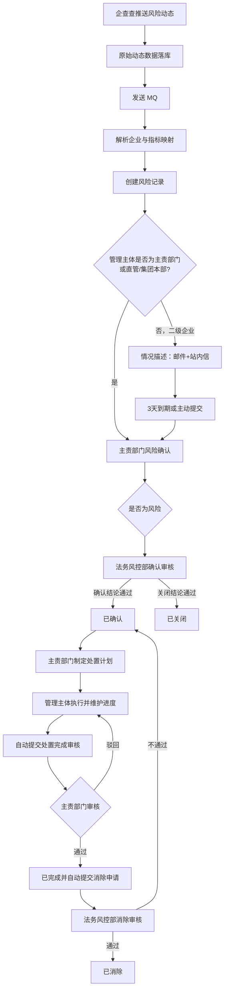

# 核心风险处理开发说明

> 来源：`开发建设方案.docx` 中“核心逻辑”“风险确认”“风险处置闭环”“整体流程优化扩展”“风险监控-风险信息”等内容。
>
> 本文以 **2026-05 的整体流程优化** 作为现行规则；其中“无需人工确认 / 自动确认”的早期方案已明确取消。方案中未最终定稿的事项单列为“待确认”，不得直接固化为业务规则。

## 1. 目标与边界

实现从外部风险动态接入，到情况描述、风险确认、处置闭环、风险消除、消息通知及留痕的完整闭环。

- 外部数据：企查查主动推送；系统接收后保存原始数据，通过 MQ 异步解析。
- 风险识别：依据企业信息与内部指标映射，生成处理后的风险记录；原始动态与风险记录分表保存。
- 核心处理：所有风险均需人工确认；主责部门确认，法务风控部审核。
- 闭环处置：主责部门制定计划，管理主体执行和维护进度，主责部门审核处置完成，法务风控部审核风险消除。
- 通知渠道：邮件、企业微信、站内信；所有推送须先落推送记录。

不在本期核心范围：风险大屏、报告样式、企查查页面嵌入、OA 基础数据同步的具体实现。

## 2. 现行关键规则

1. 所有风险必须人工确认，删除“自动确认”分支。
2. 管理主体只负责补充情况描述；是否为风险由主责部门判定。
3. 管理主体为二级企业时，先进行情况描述，默认时限为 3 天；到期后自动提交主责部门确认。
4. 管理主体即主责部门时，跳过单独的情况描述环节，在风险确认页面合并填写相关信息。
5. 直管企业直接交由主责部门（战略投资中心）处理；集团本部也直接交由主责部门处理。
6. 风险确认、风险消除均须经法务风控部审核；处置完成由主责部门审核。
7. 管理主体完成处置后自动提交处置完成审核；审核通过后自动发起风险消除申请。
8. 处置中允许发起风险等级上调或下调，并进入独立的风险等级变动审核。

## 3. 角色与职责

| 角色 | 主要职责 |
| --- | --- |
| 外部数据源 / 接口服务 | 推送风险动态，失败时可重推 |
| 系统解析服务 | 原始数据落库、MQ 消费、企业和指标匹配、生成风险记录 |
| 管理主体 | 填写情况描述；执行处置计划；维护处置进度及附件；完成处置 |
| 主责部门 | 风险确认；制定/变更处置计划；审核处置完成；必要时发起风险等级调整 |
| 法务风控部 | 审核风险确认、风险消除、风险等级调整 |
| 指标监管部门 / 指标主管部门 | 早期方案中的指标监管与接收主体；现行实现中应以指标配置确定主责部门和接收人 |
| 风险接收人 | 接收风险通知或待办；无接收人时不向该对象发送通知 |
| 战略投资中心 | 集团直管企业的处理权限主体 |

## 4. 总体流程

## 5. 状态模型

### 5.1 风险主状态

历史方案已有编码 `0~6`；现行流程新增“情况描述”。建议以字典枚举统一管理，避免在代码中散落数字。

| 建议编码 | 状态 | 进入条件 | 可流转至 |
| --- | --- | --- | --- |
| `DESCRIPTION_PENDING` | 情况描述 | 管理主体为二级企业，风险生成后 | `UNCONFIRMED` |
| `UNCONFIRMED`（历史 `0`） | 未确认 | 情况描述提交/超时自动提交；或管理主体就是主责部门 | `CONFIRM_PENDING`、`CLOSE_PENDING` |
| `CONFIRM_PENDING`（历史 `4`） | 确认待审核 | 主责部门判定“是风险” | `CONFIRMED`、`CLOSED` |
| `CLOSE_PENDING`（历史 `5`） | 关闭待审核 | 主责部门判定“不是风险” | `CLOSED`、`CONFIRMED` |
| `CONFIRMED`（历史 `1`） | 已确认 | 法务风控部审核确认结论；或驳回关闭结论 | `ELIMINATION_PENDING` |
| `ELIMINATION_PENDING`（历史 `6`） | 消除待审核 / 申请完成 | 发起风险消除申请 | `ELIMINATED`、`CONFIRMED` |
| `ELIMINATED`（历史 `2`） | 已消除 | 法务风控部消除审核通过 | 终态 |
| `CLOSED`（历史 `3`） | 已关闭 | 法务通过“不是风险”；或驳回“是风险”结论 | 终态 |

风险确认审核的判定矩阵：

| 主责部门提交结论 | 法务审核通过 | 法务审核不通过 |
| --- | --- | --- |
| 是风险（`CONFIRM_PENDING`） | `CONFIRMED` | `CLOSED` |
| 不是风险（`CLOSE_PENDING`） | `CLOSED` | `CONFIRMED` |

### 5.2 处置状态（独立于风险主状态）

风险已确认后才进入处置。处置状态不可替代风险主状态，应单独存储。

| 状态 | 规则 |
| --- | --- |
| `NOT_STARTED`（未开始） | 主责部门制订处置计划完成后 |
| `IN_PROGRESS`（进行中） | 开始维护处置进度后 |
| `OVERDUE`（已延期） | 当前时间超过计划截止时间，且未完成；应由定时任务刷新 |
| `COMPLETION_PENDING`（完成待审核） | 管理主体标记处置完成后自动提交 |
| `COMPLETED`（已完成） | 管理主体即主责部门时自动通过；或主责部门审核通过 |

处置完成审核驳回时，状态退回 `IN_PROGRESS`，发送邮件通知，并记录驳回意见。计划如需修改，走“变更处置计划”功能，不在驳回动作中隐式修改。

## 6. 功能与交互要求

### 6.1 风险接入与解析

1. 接收外部风险动态，先完整保存原始报文及接收结果；接收成功后返回成功响应。
2. 成功入库后发送 MQ；MQ 消费端负责解析，必须支持重复消息幂等。
3. 按企业信息和指标映射解析，生成风险记录，并保留原始数据关联键、来源、发生时间、解析结果与失败原因。
4. 风险列表只展示处理后的风险数据；原始数据仅供追溯。
5. 解析后按企业分组组织风险列表的二级菜单/三级标签页，并展示风险指标。

### 6.2 情况描述

适用于管理主体为二级企业的风险。

- 创建风险后向二级企业发送“情况描述”邮件和站内信，并设置默认 3 天截止时间。
- 表单字段：发生原因、决策机构（提示“请输入决策机构和会议类型”）、附件、是否报备集团、报备内容（仅选择“是”时展示，提示“请输入报备时间和主责部门”）。
- 方案早期字段“是否集团决策、决策内容、是否集团知情”应保留兼容映射；产品最终字段口径以现行 UI 为准。
- 主动提交或截止时间到达后，状态改为 `UNCONFIRMED`，向主责部门发送确认待办。
- 特殊企业（集团直管、集团本部）不进入本环节，直接进入主责部门确认。

### 6.3 风险确认与审核

1. 主责部门在风险确认页面填写“是否为风险”和补充说明；当管理主体即主责部门时，同页合并展示情况描述字段。
2. 选择“是风险”后进入 `CONFIRM_PENDING`；选择“否”后进入 `CLOSE_PENDING`。
3. 两种结论均向法务风控部创建审核待办。
4. 法务审核页面须展示情况描述、风险确认内容、附件和完整操作记录；填写审核意见及原因。
5. 审核结果按第 5.1 节矩阵流转，所有状态改变均写操作记录。

### 6.4 处置计划与进度

- 主责部门为已确认风险制订整体计划与处置步骤，至少包含计划总目标、截止时间、步骤、步骤责任人/责任部门、计划时间。
- 管理主体执行计划，企业负责人负责填写并维护进度；进度支持新增、修改、删除，并可上传附件，详情支持预览和下载。
- 风险详情展示风险内容、处置计划、当前处置状态和操作记录。
- 计划制订后处置状态为 `NOT_STARTED`；开始处置后为 `IN_PROGRESS`；超期未完成显示 `OVERDUE`。
- 管理主体完成处置后，系统自动提交“完成待审核”并提示；主责部门审核弹窗应复用风险确认审核的交互，展示前序情况描述和操作记录。
- 主责部门审核通过：处置状态置为 `COMPLETED`，自动提交风险消除申请。管理主体即主责部门时，处置完成自动通过并直接提交消除申请。
- 按季度自动向仍需完成处置的责任对象发送待办提醒。

### 6.5 风险消除

1. 仅 `CONFIRMED` 风险允许申请消除；由处置完成自动触发，亦需保留人工发起入口以兼容原流程。
2. 提交后风险状态改为 `ELIMINATION_PENDING`，向法务风控部发送审核待办。
3. 审核通过改为 `ELIMINATED`，向纵向企业链路和横向关联部门全量通知。
4. 审核不通过恢复 `CONFIRMED`，通知提交部门及审核结果。
5. 消除审核页面必须展示处置计划、进度附件及操作记录。

### 6.6 风险等级调整

- 触发条件：处置过程中风险不可控（升级）或影响较小（降级）。
- 从风险详情发起，记录原等级、申请等级、调整类型（升级/降级）、申请原因、申请人及时间。
- 待审核页面拆分为“风险状态审核”“风险等级变动审核”；已审核记录进入“已审核”菜单。
- 法务风控部按通过/不通过审核；通过后更新风险等级，始终保留调整前后值和审核记录。

## 7. 权限与可见范围

- 情况描述按钮需单独配置权限。
- 常规企业：按管理主体授权，对应一级公司具备操作权限。
- 集团本部：对应指标主管部门具备操作权限。
- 集团直管：战略投资中心具备操作权限。
- 风险确认、消除、处置审核等操作应同时校验：功能按钮权限、数据范围（管理主体/指标主管部门）和当前状态。
- 审核列表权限须细化到标签页；状态审核与等级变动审核分别授权。
- 用户管理应维护“是否风险接收人”；指标配置关联主管部门/负责人，作为主责与通知寻址依据。

## 8. 消息与待办

### 8.1 渠道与对象

渠道：企业邮箱、企业微信、站内信。发送前创建消息记录，记录渠道、模板、收件对象、业务类型、业务 ID、发送状态、重试次数与失败原因。

通知对象规则：

- 横向：指标关联/主管部门及其风险接收人。
- 纵向：风险所属企业及上级企业，最高推送至二级企业。
- 全资、控股、参股企业：从本级至二级企业的风险接收人。
- 基金类企业：从管理型基金上级至二级企业的风险接收人。
- 外部企业：按关联的内部企业至二级企业的风险接收人。
- 无风险接收人时不发送该对象的通知。
- 重大风险额外通知相关领导（方案仅给出“薛总、分管副总”描述，具体人员应配置化）。

### 8.2 事件矩阵

| 事件 | 待办 / 通知对象 | 建议渠道 |
| --- | --- | --- |
| 二级企业待情况描述 | 管理主体 | 邮件、站内信 |
| 情况描述提交或超时 | 主责部门 | 待办、站内信 |
| 主责部门提交确认/关闭结论 | 法务风控部 | 审核待办 |
| 确认结论审核通过，或关闭结论审核不通过 | 纵向企业 + 横向关联部门 | 全量通知 |
| 确认结论审核不通过，或关闭结论审核通过 | 提交部门 | 结果通知 |
| 提交处置完成 | 主责部门 | 审核待办 |
| 处置完成审核驳回 | 管理主体/提交人 | 邮件、站内信 |
| 提交消除申请 | 法务风控部 | 审核待办 |
| 消除审核通过 | 纵向企业 + 横向关联部门 | 全量通知 |
| 消除审核不通过 | 提交部门 | 结果通知 |

推送设置支持实时与定时两类规则；实时规则直接发送，定时规则由任务调度执行。消息发送需异步化、可重试、可查询，不得阻塞状态流转事务。

## 9. 数据设计建议

现有 `supervise_risk` 仅覆盖基础风险字段和早期操作状态，无法承载现行闭环。建议在保留历史兼容字段的同时扩展如下实体：

| 实体 | 关键字段 |
| --- | --- |
| `supervise_risk` | 风险指标、内容、等级、类型、企业、企业分组、发生时间、风险主状态、管理主体、主责部门、原始动态 ID、当前处置状态、版本号、创建/更新时间 |
| `supervise_risk_raw` | 来源、来源唯一键、原始报文、接收时间、解析状态、解析错误、风险 ID |
| `supervise_risk_description` | 风险 ID、发生原因、决策机构、是否报备集团、报备内容、附件、提交人、提交时间、截止时间、自动提交标记 |
| `supervise_risk_confirmation` | 风险 ID、是否风险、补充说明、提交部门/人、提交时间、审核意见、审核原因、审核人、审核时间 |
| `supervise_disposal_plan` | 风险 ID、总目标、截止时间、计划状态、制订人、版本、提交完成时间、审核意见 |
| `supervise_disposal_step` | 计划 ID、步骤、责任部门/人、计划时间、排序、状态 |
| `supervise_disposal_progress` | 计划/步骤 ID、进展内容、进展时间、填报人、附件、是否完成 |
| `supervise_risk_level_change` | 风险 ID、原等级、目标等级、调整类型、原因、申请/审核信息、状态 |
| `supervise_risk_operation_log` | 风险 ID、操作类型、前后状态、操作内容、操作人、操作时间、关联业务 ID |
| `supervise_message_record` | 业务类型、业务 ID、渠道、模板、接收人、发送状态、请求/响应、重试信息 |

约束与索引：外部来源唯一键应建唯一索引；所有子表以风险 ID 建索引；审核与状态流转使用乐观锁版本号或条件更新，防止重复提交/并发审核。

## 10. 接口建议

以下为实现建议，路径可按现有 `/supervise/risk` 规范调整。

| 接口 | 用途 |
| --- | --- |
| `POST /supervise/risk/dynamics` | 外部风险动态接收，按来源唯一键幂等 |
| `GET /supervise/risk` / `GET /{id}` | 风险列表、详情（含状态、处置、操作记录） |
| `POST /supervise/risk/{id}/description` | 保存/提交情况描述 |
| `POST /supervise/risk/{id}/confirm` | 主责部门提交“是/否风险”结论 |
| `POST /supervise/risk/{id}/confirmation-audit` | 法务风控部审核确认结论 |
| `POST /supervise/risk/{id}/disposal-plans` | 新建或变更处置计划及步骤 |
| `POST /supervise/disposal-plans/{id}/progress` | 维护处置进度及附件 |
| `POST /supervise/disposal-plans/{id}/complete` | 标记处置完成，自动生成审核任务 |
| `POST /supervise/risk/{id}/disposal-audit` | 主责部门审核处置完成 |
| `POST /supervise/risk/{id}/elimination` | 申请风险消除 |
| `POST /supervise/risk/{id}/elimination-audit` | 法务风控部审核消除 |
| `POST /supervise/risk/{id}/level-changes` | 发起风险等级调整 |
| `POST /supervise/risk/{id}/level-change-audit` | 审核风险等级调整 |

所有变更接口应校验当前状态、操作者权限和请求幂等键；成功后在同一业务事务内写操作日志与待发送消息事件，消息由异步消费者投递。

## 11. 定时任务与可靠性

- **情况描述超时任务**：扫描 `DESCRIPTION_PENDING` 且到期未提交的记录，幂等地自动提交至 `UNCONFIRMED` 并创建主责部门待办。
- **处置逾期任务**：扫描未完成计划，超过截止时间更新为 `OVERDUE`。
- **季度提醒任务**：向未完成处置的责任对象发送待办。
- **定时推送任务**：执行推送设置中的定时规则。
- **消息重试任务**：重试发送失败但未超过阈值的消息；超过阈值记录失败并告警。
- **MQ 幂等**：以外部来源唯一键/消息 ID 去重；消费、状态变更、消息投递均应支持至少一次投递语义。

## 12. 验收要点

1. 重复接收同一外部动态不会产生重复风险；原始数据和解析结果可追溯。
2. 二级企业风险创建后进入情况描述，3 天到期自动转主责部门确认；特殊企业可直接确认。
3. 所有风险都必须经过主责部门确认和法务风控部审核，不存在自动确认路径。
4. 四种风险确认审核组合均按第 5.1 节正确落到已确认或已关闭。
5. 已确认风险可完成“计划—进度—完成审核—消除审核”闭环；驳回后正确恢复进行中状态。
6. 处置超期自动显示已延期，季度提醒可查。
7. 每次状态、等级、计划、进度、审核和通知均有操作记录；详情与审核页可查看完整历史和附件。
8. 通知对象遵循企业链路、关联部门、接收人和二级企业上限规则；无接收人不误发。
9. 状态审核与等级变动审核在待审核/已审核中分别可见，且按权限控制。

## 13. 待产品确认事项

以下内容在原方案中存在疑问、前后表述差异或只给出方向，开发前需确认：

1. “是否集团决策 / 决策内容 / 是否集团知情”与“决策机构 / 是否报备集团 / 报备内容”的最终字段口径及是否同时保留。
2. 处置步骤责任人是否可跨部门、责任人是否有独立待办和全量查看权限。
3. 处置计划修改的权限、版本规则，以及驳回后是否允许直接修改原计划。
4. 风险消除是否仅允许由处置完成自动发起，还是保留人工申请入口。
5. 重大风险的领导接收人、风险等级阈值和消息模板应配置化，避免在代码中写死具体人员。
6. “情况描述”在正式状态字典中的编码、历史 `operation_status` 的迁移方案，以及处置状态是否需单独枚举字段。
